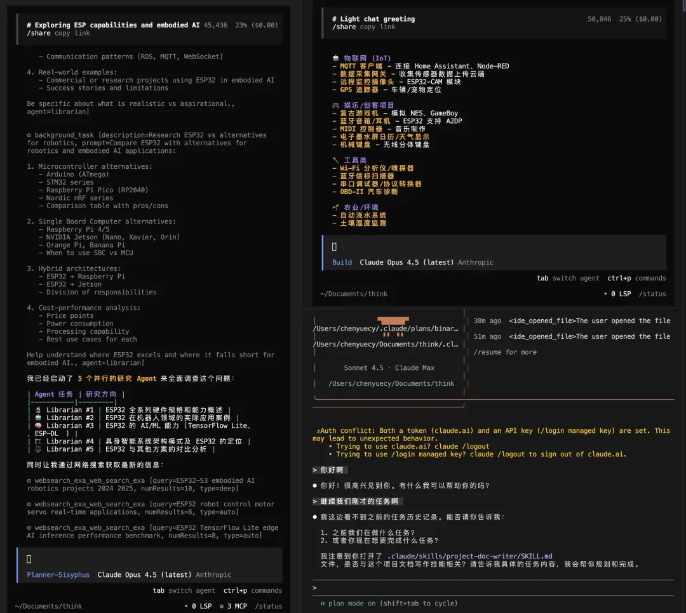

**来源**: CY：OpenCode + Oh My OpenCode 一份老奶奶都能看懂的 AI 编程指南 | **时间**: 2026-01-04 | **原文链接**: https://mp.weixin.qq.com/s/TRwiDRTb...



---

### 📋 核心分析

**战略价值**: OpenCode（开源 Claude Code 替代品）+ Oh My OpenCode（预置插件包）= 多模型自由切换 + AI 团队协作编程，3 分钟装好即用，效率提升 4x（8小时→2小时）。

**核心逻辑**:

- **为什么选 OpenCode 而非 Claude Code**：Claude Code 只能绑定 Claude 单一模型、封闭不可扩展、终端界面偶发闪烁；OpenCode 开源，支持 Claude/GPT/Gemini 混用，社区插件生态丰富，配置完全可控。
- **Oh My OpenCode 的本质**：不是单个 AI，而是预置好的 AI 团队插件包，免去手动配置，装上即获得 5 个专职 Agent 分工协作。
- **5 个内置 Agent 的分工**：Sisyphus（总指挥，默认执行者）、Oracle（架构设计+难题调试）、Librarian（查官方文档+资料）、Explore（全代码库搜索）、Frontend Engineer（UI/前端专责）。
- **魔法词 `ulw` 是核心杠杆**：加上 `ulw` 后 AI 进入全力模式——自动派出多个子 Agent 并行干活、直到任务完成才停止、自动搜索资料，不加则默认单轮响应。
- **Plan/Build 双模式工作流**：Tab 键切换；Plan 模式只输出方案不动代码（适合需求确认），Build 模式真实修改文件（适合方案确定后执行），标准流程：先 Plan 对齐 → 再 Build 执行。
- **后台并行能力**：多个 Agent 可同时运行，一个写前端、一个写后端、一个查资料，互不阻塞，完成后统一汇报，彻底告别串行等待。
- **`/init` 初始化是必做步骤**：运行后 AI 自动分析项目并生成 `AGENTS.md`（员工手册），后续所有 Agent 都读这个文件了解项目技术栈、规范、约束，避免反复重复背景。
- **对话质量维护**：长对话会导致 AI 上下文衰减变"傻"，用 `/compact` 压缩历史（保留摘要）或 `/new` 开新会话重置，是保持 AI 输出质量的关键操作习惯。
- **`!命令` 直接执行终端**：在对话框前缀 `!` 可让 AI 直接运行终端命令并读取输出，例如 `!npm start` 让 AI 看到实际报错后自动修复，省去复制粘贴错误信息。
- **图片输入支持**：直接将图片拖入终端窗口即可让 AI 分析，适用于 UI 还原、报错截图分析等场景。

---

### 🎯 关键洞察

**效率乘数来自"团队模式"而非"单 AI 对话"**

普通 AI 对话是串行的：你问 → AI 答 → 你问 → AI 答。每一步都需要你盯着、推动。

Oh My OpenCode 的架构是并行的：你说需求 → Sisyphus 拆解任务 → Oracle/Librarian/Explore/Frontend Engineer 同时开工 → 汇总结果给你。

这才是从"实习生"到"项目经理带团队"的本质跃迁。实测效果：同等工作量从 8 小时压缩到 2 小时。

**`ulw` 的机制原理**：该关键词触发 Oh My OpenCode 的编排层，强制开启多 Agent 并行 + 持续执行模式，等价于告诉系统"不惜 token，干到完为止"。不加 `ulw` 时 AI 倾向于给出单次简短回复后停下等待确认。

---

### 📦 配置/工具详表

| 模块/功能 | 关键设置/代码 | 预期效果 | 注意事项/坑 |
|----------|-------------|---------|-----------|
| 安装 OpenCode（Linux/Mac curl） | `curl -fsSL https://opencode.ai/install \| bash` | 全局安装 opencode 命令 | 需要网络畅通 |
| 安装 OpenCode（Mac Homebrew） | `brew install opencode` | 同上，更新维护更方便 | 需先装 Homebrew |
| 安装 Oh My OpenCode | 进入 opencode 对话后说："帮我安装 oh-my-opencode 插件" | AI 自动完成插件安装 | 必须先启动 opencode 才能让 AI 装 |
| 登录账号 | `opencode auth login` | 绑定 Claude/GPT/Gemini 等服务 | 浏览器自动打开授权页 |
| 免费账号注册 | 对话内输入 `/connect`，选 opencode | 获取免费使用资格 | 无付费账号时的替代方案 |
| 项目初始化 | `/init` | 生成 `AGENTS.md` 员工手册 | 每个新项目必做，否则 AI 不了解项目背景 |
| AGENTS.md 自定义规范 | 编辑文件，写入代码风格/技术栈/命名规范等 | AI 后续严格遵守规范 | 越具体越好，例如"注释用中文、变量名驼峰" |
| 全力模式 | 对话中加 `ulw` 前缀 | 多 Agent 并行+持续执行直到完成 | 消耗 token 较多，适合复杂任务 |
| 深度思考模式 | 对话中加 `ultrathink` | AI 进行深度推理，适合复杂 bug 排查 | 响应时间更长 |
| 搜索模式 | 对话中加 `search` 或 `find` | 全力搜索模式 | 适合定位代码位置 |
| 分析模式 | 对话中加 `analyze` | 深度分析模式 | 适合代码审查、架构评审 |
| 调用特定 Agent | `@oracle`、`@librarian`、`@explore`、`@frontend engineer` | 定向调用对应专职 Agent | 不加 @ 默认由 Sisyphus 总指挥分配 |
| 引用文件 | `@src/App.js` 文件路径格式 | AI 精确读取指定文件内容 | 路径相对于项目根目录 |
| 执行终端命令 | `!npm start`（感叹号前缀） | AI 执行命令并读取输出，自动处理报错 | 让 AI 直接看报错，不用手动复制 |
| 压缩对话 | `/compact` 或 `Ctrl+X → C` | 保留摘要，清理历史，恢复 AI 智力 | 长对话必用，防止 AI 上下文衰减 |
| 撤销操作 | `/undo` 或 `Ctrl+X → U` | 回退 AI 上一步代码修改 | 等价于代码级 Ctrl+Z |
| 重做操作 | `/redo` 或 `Ctrl+X → R` | 恢复被撤销的修改 | — |
| 新开对话 | `/new` 或 `Ctrl+X → N` | 全新会话，彻底清空上下文 | 切换完全不同任务时使用 |
| 查看历史对话 | `Ctrl+X → L` | 浏览历史会话记录 | — |
| 分享对话 | `/share` | 生成可分享链接 | — |
| 图片输入 | 直接拖拽图片到终端窗口 | AI 分析图片内容 | 适合 UI 还原、截图报错分析 |

---

### 🛠️ 操作流程

#### 安装流程（3 分钟）

1. **安装 OpenCode**
   ```bash
   curl -fsSL https://opencode.ai/install | bash
   # 或 Mac 用户：
   brew install opencode
   ```

2. **启动并安装 Oh My OpenCode 插件**
   ```bash
   opencode
   # 进入对话后输入：
   # "帮我安装 oh-my-opencode 插件"
   ```

3. **登录 AI 服务账号**
   ```bash
   opencode auth login
   # 浏览器弹出授权页面，选择 Claude/GPT/Gemini 并登录
   # 无付费账号则在对话内输入 /connect → 选 opencode → 注册免费账号
   ```

#### 标准工作流（每次开工）

1. **进入项目目录**
   ```bash
   cd /your/project/folder
   ```

2. **启动 OpenCode**
   ```bash
   opencode
   ```

3. **初始化项目（新项目必做）**
   ```
   /init
   ```
   AI 自动生成 `AGENTS.md`，可手动补充代码规范、技术栈偏好。

4. **按 Tab 切换到计划模式（Plan）**，描述需求：
   ```
   我想做一个待办事项小程序，需要添加、删除、标记完成功能，你有什么方案？
   ```

5. **确认方案后，按 Tab 切回执行模式（Build）**，下达指令：
   ```
   ulw 就按你说的方案来，开始做吧
   ```

6. **等待 AI 团队并行完成，中途无需干预**，完成后审查结果。

7. **如有问题**，用 `/undo` 撤销，或继续对话修正。

#### 复杂任务流程

```
# 重构整个项目
ulw 帮我把项目从 JavaScript 改成 TypeScript

# 深度 debug
ultrathink 这个 bug 到底是怎么产生的？@src/utils/helper.js

# 定向查文档
@librarian 这个功能在官方文档里怎么写的？

# 看实际报错后修复
!npm start
（AI 自动读取报错并修复）

# 重构建议流程（先 Plan 后 Build）
[Tab → Plan 模式] 我想重构这个项目，有什么建议？
[看完建议]
[Tab → Build 模式] 就按你说的方案来，开始吧
```

---

### 💡 具体案例/数据

| 场景 | 指令示例 | AI 行为 |
|------|---------|---------|
| 写新功能 | `ulw 帮我写一个待办事项小程序，能添加、删除、标记完成` | 自动规划→创建文件→写代码→测试 |
| 修 bug | `!npm start`（看到报错后）AI 自动修复 | 读取真实报错输出，定向修复 |
| 理解代码 | `@src/utils/helper.js 这个文件是干什么的？` | 精确分析指定文件 |
| 重构项目 | Plan 模式听方案 → Build 模式执行 | 先对齐期望再动手，避免返工 |
| 架构评审 | `@oracle 帮我看看这个架构合不合理` | 调用架构专职 Agent 深度评估 |
| 查官方文档 | `@librarian 这个功能在官方文档怎么写的？` | 检索文档返回标准用法 |
| 定位代码 | `@explore 找一下所有登录相关的代码` | 全库搜索，列出所有相关位置 |

**效率数据**：作者实测，同等工作量从每天 8 小时压缩到 2 小时，节省 75% 时间，节省出的时间用于需求判断、用户洞察、架构设计等高阶思考。

---

### 📝 避坑指南

- ⚠️ **不加 `ulw` AI 容易半途而废**：复杂任务不加 `ulw`，AI 倾向于输出一部分后停下等待，必须手动催促。加了 `ulw` 才会持续执行到完成。
- ⚠️ **对话太长 AI 变傻**：上下文过长会导致 AI 遗忘前置信息、质量下降。定期用 `/compact` 压缩，或任务切换时 `/new` 开新会话。
- ⚠️ **新项目必须先跑 `/init`**：不初始化直接让 AI 干活，它不了解项目结构和技术栈，容易生成不符合项目规范的代码。
- ⚠️ **Plan 模式确认方案再执行**：直接进 Build 模式下达模糊需求，AI 可能理解偏差后大量改动代码，返工成本高。先 Plan 对齐再 Build 执行是防止返工的标准姿势。
- ⚠️ **AI 改错代码立刻 `/undo`**：不要在错误基础上继续对话，越改越乱。发现方向错误立即撤销，回到正确状态重新描述需求。
- ⚠️ **新手不懂 AI 输出时**：直接告诉 AI "用更简单的方式解释，我是新手"，AI 会调整表达方式，不要硬啃。
- ⚠️ **AI 中途停止**：加上 `ulw 继续刚才的任务`，强制恢复并行持续执行模式。

---

### 🏷️ 行业标签

#AI编程 #OpenCode #ClaudeCode #MultiAgent #终端工具 #开发效率 #OhMyOpenCode #开源工具
