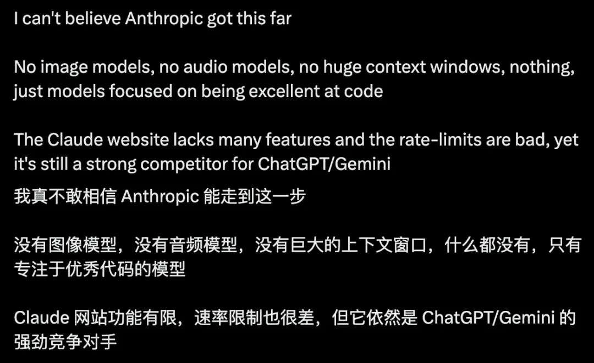

# AI产品与商业化

## 📙 文章 4

> 文档 ID: `Z8UEwB9X2iWohnkFxmAc5fFMn7e`

**来源**: 我真不敢相信 Anthropic 能走到这一步 | **时间**: 2026-01-04 | **原文链接**: https://mp.weixin.qq.com/s/ysRx5rJJ...

---

### 📋 核心分析

**战略价值**: 用"资源约束 → 聚焦 Coding → 可靠性前置 → 企业场景"这条因果链，完整还原了 Anthropic 在算力弱势下逆袭第一梯队的底层战略逻辑，为任何资源受限的产品团队提供可复用的决策框架。

**核心逻辑**:

- **资源差距是物理约束，不是理念问题**：Anthropic 创立之初就明确：他们既没有 Sam Altman 调动资本的能力，也没有谷歌的基础设施家底，这种差距在可预见时间内不会消失，不能靠"等融资抹平"的幻想来制定战略。

- **资源受限逼出了"取舍思维"**：当算力有限、研究精力有限时，团队内部的核心问题不是"还缺哪些能力"，而是"在有限资源里，哪些场景值得长期投入，哪些即便看起来合理也必须先放下"——这是两种完全不同的决策模式。

- **选择训练场景的筛选标准**：难度高 + 容错率低 + 结果可清晰验证 = 最高效的训练场。低难度、高容错的场景即便模型做得再好，对整体能力的拉动也有限；反之，最苛刻的场景能顺带提升其余能力。

- **Coding 是"必然选择"而非主动偏好**：写代码要求长链路推理、强约束、低容错——逻辑一旦断裂，结果立刻暴露，没有含糊其辞的空间。同时，代码结果极易验证（能跑/不能跑）。Anthropic 并不是先立目标"做最会写代码的模型"，而是被资源逻辑一步步逼到这个选择上。

- **可靠性必须前置到训练阶段，而非留到使用阶段补救**：当训练成本极高（算力 + 时间 + 人力 + 后续验证）时，"先做出模型，出问题再用规则/审核兜底"的方式边际成本会随模型规模增大而急剧上升。对资源不宽裕的团队，这种消耗承受不起——"减少不可控行为 = 减少返工 = 减少重训 = 减少隐性资源损耗"。

- **Anthropic 频繁谈 AI 安全的真实动机**：不是道德标杆姿态，而是工程效率判断——模型行为不可控，训练成本会被反复浪费。安全性/可预测性在这里是效率变量，不是公关变量。

- **稳定性是训练阶段的特性，会被完整带入使用阶段**：训练中形成的行为收敛，在真实工作流中表现为"可预测"——这在 Demo 阶段不显眼，但在企业生产环境（模型需嵌入流程、反复运行、承担责任）中是最先被感知到的核心价值。

- **企业场景的评价标准与 Demo 阶段根本不同**：Demo 看"极限能力"（单次交互有多惊艳）；企业生产看"行为是否可预测"（能不能稳定工作、失败时能否被快速识别、错误会不会扩散）。Anthropic 走向 Enterprise 是战略逻辑的自然延伸，不是刻意转型。

- **行业范式迁移正在发生**：当模型从"展示阶段"进入"真实系统参与决策和执行"阶段，"能力强"和"能不能用"开始分裂成两件不同的事。更强不再自动等于更好用；激进不再是单纯优势；稳定开始变得昂贵。

- **Anthropic 没有图像模型、音频模型、超长上下文，功能不丰富，请求限额严**——但依然是 ChatGPT、Gemini 的强劲对手，Claude（尤其 Opus 和 Sonnet）在编码、写邮件、内容写作上体验突出，本质上是"悄悄赢得了文本游戏"。

---

### 🎯 关键洞察

**"被逼出来的专注"比"主动选择的专注"更有韧性**

大多数公司谈"专注"时，背后其实是资源充足后的主动取舍——随时可以反悔、补齐。而 Anthropic 的专注是从物理约束出发推导出来的：资源差距不会消失 → 每次投入都是取舍 → 必须选最高效的训练场 → Coding 是必然落点。

这条推导链一旦成立，专注就不再是风格问题，而是生存逻辑。这也是为什么 Dario 和 Altman 是"完全两种不同风格的 CEO"——Altman 的打法建立在调动资本、快速扩张能力边界的前提上；Dario 的打法建立在承认并接受资源约束、在约束内最大化训练效率的前提上。

**失败代价放大时，稳定比极限更值钱**

在 Coding 低容错场景里，一次不稳定输出不是"体验略差"，而是：代码不能跑 → 工程师排查 → 前面时间浪费 → 流程中断。这个关系在消费级产品里不明显，但在企业生产环境里，每个不稳定节点都会向后扩散，容错空间越小，扩散损耗越大。

所以"可靠性 > 极限能力"不是保守主义，而是在高失败代价场景下的理性定价。

---

### 📦 战略选择对比

| 维度 | 资源充裕打法（OpenAI/Google 路线） | 资源约束打法（Anthropic 路线） |
|------|----------------------------------|-------------------------------|
| 能力覆盖 | 图像、音频、超长上下文、多模态全铺 | 纯文本模型，Coding/写作场景深耕 |
| 问题核心 | "还缺哪些能力" | "有限资源里哪些场景值得长期投入" |
| 可靠性处理时机 | 使用阶段补救（规则/审核/流程兜底） | 训练阶段前置收敛 |
| 安全性定位 | 主要是公关/合规考量 | 工程效率变量（减少重训、减少返工） |
| 目标用户 | 消费级 + 企业同步扩张 | 自然走向 Enterprise 场景 |
| Demo vs 生产 评价标准 | 极限能力、单次惊艳 | 行为可预测、错误不扩散 |
| CEO 风格 | Altman：调动资本、快速扩张 | Dario：承认约束、最大化训练效率 |

---

### 🛠️ 可复用决策框架（适用于任何资源受限产品团队）

1. **确认约束是长期现实，而非暂时状态**：如果资源差距在可预见时间内不会消失，所有决策都必须建立在"长期约束"前提下，而不是"等拿到资源再补齐"。

2. **把核心问题从"缺什么"改为"该放下什么"**：资源有限时，今天多投一个方向，明天就一定在另一个方向少做一些。取舍是主动选择，不是被动残缺。

3. **用"训练场质量"而非"覆盖面"评估场景价值**：筛选标准：推理一致性要求高 + 容错率低 + 结果可清晰验证。满足这三点的场景，训练效率最高，且能顺带拉动其他能力。

4. **把可靠性从"使用阶段问题"升格为"训练阶段目标"**：当训练成本高到一定程度，补救的边际成本会超过预防成本。在训练中收敛行为 = 减少返工 = 提高每次训练的有效性。

5. **在真实生产场景中，用"行为可预测性"而非"极限能力"作为核心 KPI**：模型嵌入流程后，评价标准自然从"能有多聪明"迁移到"能不能稳定工作、失败能否快速识别、错误会不会扩散"。

---

### 💡 具体支撑数据/案例

- **Claude Opus 和 Sonnet**：在编码、写邮件、内容写作场景中被用户明显感知优于竞品，即便 Anthropic 官网功能不丰富、请求限额严格。
- **Daniela Amodei（Anthropic 总裁）接受 CNBC 采访**：公开讨论了在资源明显少于 OpenAI、Google 的情况下如何做出第一梯队模型的决策逻辑。
- **Anthropic 产品现状佐证专注策略**：截至文章发布时，无图像模型、无音频模型、无动辄超长上下文窗口，功能单一，但市场竞争力不减。

---

### 📝 避坑指南

- ⚠️ **不要把"专注"当风格标签**：Anthropic 的专注不是因为他们"更有匠心"，而是资源约束下的推导结果。如果你的资源约束不同，这套逻辑推导出的专注方向也会不同，不能直接照搬"做 Coding"这个结论。

- ⚠️ **不要在高失败代价场景里用"先做出来再补救"的路线**：当模型规模大、训练成本高时，使用阶段补救的边际成本会指数级上升，对资源受限团队是不可持续的。

- ⚠️ **"更强"不自动等于"更好用"**：当模型已足够强、进入真实生产时，极限能力的边际价值下降，稳定性/可预测性的价值上升。产品定位和竞争叙事需要随之迁移。

- ⚠️ **Demo 阶段的评价标准会误导产品决策**：用"单次交互惊艳感"衡量模型好坏，在企业生产场景里会系统性低估可靠性的价值，导致错误的模型选型和功能优先级。

---

### 🏷️ 行业标签

#Anthropic #Claude #AI战略 #资源约束 #模型可靠性 #Enterprise #Coding场景 #产品专注 #训练效率 #AGI竞争格局

---
