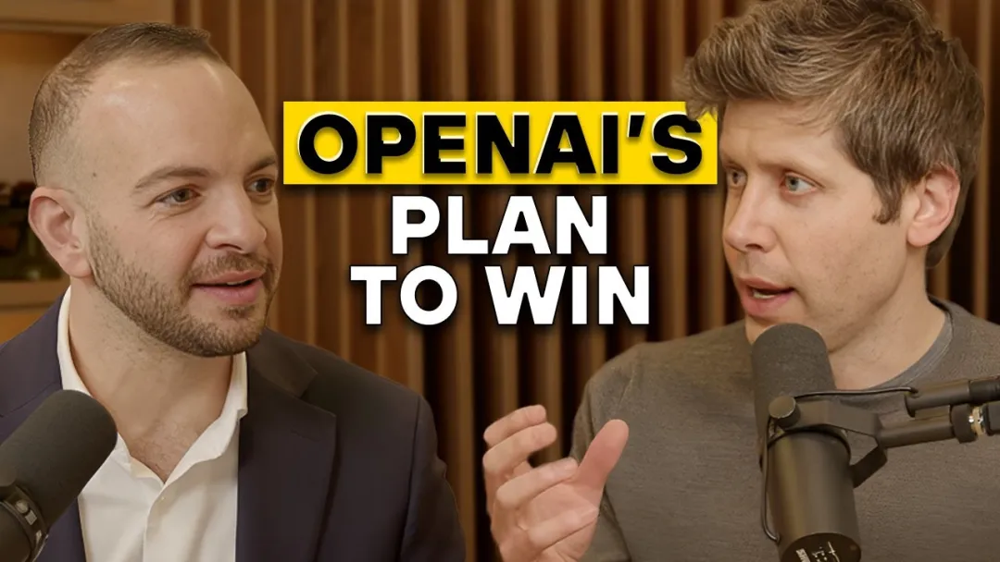

# AI产品与商业化

## 📔 文章 5

> 文档 ID: `DOrswzPhSiNJRtk695zcX42BnVd`

**来源**: 深度｜对话Sam Altman：企业级市场是OpenAI 26年重点发力方向，25年B端业务增长已超过C端增长 | **时间**: 2026-01-04 | **原文链接**: https://mp.weixin.qq.com/s/m2aNZPwv...

---

### 📋 核心分析

**战略价值**: Sam Altman 亲口阐述 OpenAI 2026 年战略优先级全貌——企业级市场是核心发力点，memory 个性化是差异化护城河，$1.4T 基础设施投入逻辑清晰，并首次提出可操作的 Super Intelligence 定义框架。

**核心逻辑**:

- **竞争应对机制已制度化**：OpenAI 设立"红色警报"机制（Red Alert），每次持续 6-8 周，历史上 DeepSeek、Gemini 3 各触发一次。触发后立即加速产品发布（GPT-5.2 于警报期间上线，图像模型同期发布），Altman 引用疫情逻辑：早期行动价值远高于后期行动，保持适度偏执是正确策略。

- **2025 年企业端增速已超消费端**：Altman 明确表示"今年 enterprise 的增长超过了 C 端的增长"，原因是模型能力已达到企业实用门槛，同时 ChatGPT 在 C 端的品牌认知正在反哺企业采购决策——企业员工说"我知道 OpenAI，我知道怎么用 ChatGPT"。

- **GDPVal 是核心企业销售武器**：GDPVal（GDP-weighted evaluation）覆盖 40+ 企业垂直职能（PowerPoint 制作、法律分析、webapp 编写等），评估专家是否更偏好模型输出。GPT-5（夏季版）beat/tied 专家率 38.8%；GPT-5.2 thinking 达 70.9%；GPT-5.2 Pro 达 74.1%，跨越"专家级任务阈值"。企业现实含义：分配给 AI 一小时任务，70-74% 概率你会更满意其输出。

- **企业端优先布局的三大垂直领域**：Coding（当前最大规模）、Finance、Science（Altman 个人最兴奋）；顾客支持（Customer Support）已有显著落地。案例：Codex 在不到一个月内完成 Sora Android App 的主体开发，消耗"海量 tokens"，替代了原本需要大量人员更长时间才能完成的工作。

- **Memory 当前处于"GPT-2 时代"**：现有 memory 功能被 Altman 定性为极早期、粗糙阶段。终态愿景：AI 记住用户一生每一个细节，捕捉用户自己都未意识到的细微偏好。这一能力不依赖人类助理的生物限制，AI 可做到完美、无限记忆。Altman 预计完全实现不在 2026 年，但是重点投入方向。

- **当前 ChatGPT 界面进化方向**：Altman 坦承 ChatGPT 界面三年变化出乎意料地小，他低估了 chat 界面的通用性。下一步方向：(1) AI 为不同任务动态生成不同 UI（如对话数据时出现可交互数据视图，类似升级版 Canvas）；(2) AI 围绕"对象"持续对话并实时更新；(3) AI 主动在后台工作，定时批量推送更新，而非被动响应——Codex 已展示此方向雏形。

- **AI Platform 是企业真实需求，OpenAI 目前缺少 All-in-One 方案**：企业明确表达诉求：定制化 API、定制化 ChatGPT Enterprise、可运行全部 Agents 的平台、可信任的数据托管、内部流程效率化，且 2026 年 token 供给仍将无法满足需求。Altman 明确："我们现在还没有一个很好的 all-in-one 解决方案，我们想把这个做出来"——这是 2026 年企业产品的核心建设任务。

- **$1.4T 基础设施投入财务逻辑**：训练支出占比将随时间下降（总量仍上升），推理收入将逐步吞没训练成本。核心命题：compute 不足是收入增长的瓶颈，而非需求不足——"如果我们现在有双倍 compute，我们现在就会有双倍收入"。过去一年 compute 翻了 3 倍，计划每年再翻 3 倍，营收增速略快于此节奏。

- **Capability Overhang（能力过剩）是被低估的系统性现象**：Altman 首次提出"z 轴"模型——在 short/long timeline × slow/fast takeoff 的 2×2 矩阵之外，需加入 overhang 大/小维度。当前判断：世界大部分地方的 overhang 极大，即模型能力远超用户实际使用方式。多数人仍在用 5.2 做 GPT-4 时代的问题。工作流惯性是核心阻力，Altman 本人也承认自己没有充分利用 AI 改造自身工作流。

---

### 🎯 关键洞察

**洞察一：AI-first 产品 vs AI 叠加产品的结构性差异**

Altman 明确判断：将 AI 叠加到现有产品上（如在 messaging app 里加总结功能）只能微幅改善，不是终局。终局是围绕 AI 从头设计的产品——用户早晨向 AI 说明今天目标、担忧与意图，AI 全天在后台自主处理，只在必要时介入并批量推送更新。这对企业软件采购具有直接含义：叠加 AI 的旧产品（如 Google Workspace + Gemini）在设计哲学上处于劣势，与具有分发优势无关。

**洞察二：企业 ROI 的"双重信号"悖论**

Altman 同时收到两种相互矛盾的企业反馈：(1) 部分企业说"就算价格提高 10 倍我们也还是会买"；(2) 另一批企业报告 ROI 不佳、落地困难。Altman 的解释是：问题不在模型能力，而在工作流改造滞后——管理层习惯让 junior analyst 做的事，即便 AI 能做到 70% 更优，实际调用率仍然极低。这一现象就是 capability overhang 的微观体现。

**洞察三：Super Intelligence 的可操作定义（首次明确提出）**

Altman 承认 AGI 定义模糊、已在某个时间点悄然"路过"，提出 Super Intelligence 的候选定义：**当一个 AI 系统在执行美国总统、大型公司 CEO 或顶级科研机构负责人的职责时，表现优于同样使用 AI 辅助的人类个体。** 同时引用国际象棋框架：当前阶段对应"人类+AI > 单独 AI"，未来某点将翻转为"有人类参与反而会拖后腿"。这是迄今 Altman 对 AGI 之后阶段最具操作性的公开定义。

**洞察四：科学发现时间线提前**

Altman 原预期科学领域小型 discoveries 从 2026 年开始，实际 2025 年已经出现。触发信号：Twitter/X 上数学家群体讨论 GPT-5.2 发布五天内的使用感受，多位数学家表示该模型已"跨越边界"，能在协助下完成小型证明并改变研究工作流。Altman 判断：从"有一点点"到"完全没有"是质性跃迁，这是科学发现曲线已经"离开 x 轴"的信号。

---

### 📦 配置/工具详表

| 模块/功能 | 关键设置/代码 | 预期效果 | 注意事项/坑 |
|----------|------------|---------|-----------|
| GDPVal 基准 | 40+ 企业垂直职能任务，专家偏好投票 | GPT-5.2 Pro：74.1% beat/tied 专家；GPT-5.2 thinking：70.9% | 仅覆盖边界清晰的小任务，不含开放式创意工作或协作型任务 |
| ChatGPT Memory | 当前版本（Altman 定性为"GPT-2 阶段"） | 可跨会话保留用户偏好、行程规划上下文 | 仍非常早期粗糙，完整个性化能力不在 2026 年实现 |
| Codex | 企业代码生成，token 用量无上限（内部） | 不到一个月完成 Sora Android App 主体 | 需大量 token 消耗，成本需评估 |
| Canvas | 围绕"对象"持续对话更新 | 比纯 chat 更适合文档/数据场景 | 现阶段仍以来回对话为主，互动性待提升 |
| ChatGPT Enterprise | 企业定制 API + 平台 | 覆盖内部流程、对外服务、agent 运行 | 2026 年 all-in-one 方案尚未完成，当前无统一解决方案 |
| AI Device（未发布） | 小型家族，包含无屏幕形态 | 常态感知用户上下文，支持耳旁提示等非 GUI 交互 | Altman 本人坦承"也可能最终完全错"，仍是探索方向 |

---

### 🛠️ 操作流程（企业落地 AI 的推荐路径，基于 Altman 访谈逻辑提炼）

1. **评估起点**：用 GDPVal 框架筛选企业内哪些职能属于"定义明确、持续时间不长的知识类任务"（法律分析、PPT 制作、代码生成、数据报告等），这些是 ROI 最确定的切入点。

2. **Coding 优先**：Altman 明确 Coding 是当前最大企业落地场景。用 Codex 接管 junior 级开发任务，评估 token 消耗 vs 人工成本对比。

3. **建立工作流替代，而非叠加**：不要在现有 workflow 里插入 AI 总结/草稿功能，要重新设计流程——早晨设定目标，AI 全天后台处理，定时批量汇报结果，减少人工中断。

4. **部署 ChatGPT Enterprise + 定制 API**：当前方案虽不完整，但已可覆盖顾客支持（Customer Support 已有显著效果）、内部知识库问答、代码审查等垂直场景。

5. **规划 2026 年 all-in-one 迁移**：根据 Altman 信号，OpenAI 2026 年将推出更完整的企业平台（含 Agent 运行、数据托管、定制 ChatGPT Enterprise）。现在建立 API 集成基础，为后续迁移准备。

6. **验证与 ROI 核算**：用 GDPVal 逻辑验证——给 AI 分配具体任务，让相同资历的人类完成同样任务，盲测偏好率是否接近 70%。若是，则该职能应大规模迁移。

---

### 💡 具体案例/数据

**Codex 构建 Sora Android App**
- 时间：不到一个月
- 方式：OpenAI 内部团队使用 Codex，消耗"海量 tokens"（内部无限额）
- 效果：完成原本需要大量人员花费更长时间的开发工作，Codex 承担了"大部分"

**GPT-5.2 数学突破信号（2025 年）**
- 事件：GPT-5.2 发布约 5 天后，Twitter 上数学家群体出现自发讨论
- 内容："我以前非常怀疑 LLMs 何时能真的变得有用，5.2 是跨越那条线的模型，它在帮助下完成了这个小证明，正在改变我的工作流"
- 背景印证：Greg Brockman 同期在 feed 中大量强调数学和科学应用案例

**Token 规模类比（量级参考，Altman 自注"不严谨"）**
- 当前：一家顶级 AI 公司每天从前沿模型生成约 10 trillion tokens
- 全人类：约 80 亿人 × 每人每天约 20,000 tokens ≈ 160 trillion tokens/天
- 趋势：Altman 预测很快单家公司日输出将超过全人类总输出，然后是 10 倍、100 倍

**IQ 测试结果（第三方测试）**
- GPT-5.2：各机构测试结果在 144-151 区间，取决于测试方

---

### 📝 避坑指南

- ⚠️ **不要把 AI 叠加在旧工作流上**：Altman 明确，这只是"微幅改善"，不是终局。在旧 messaging app 里加 AI 总结功能，不如重新设计工作流。

- ⚠️ **GDPVal 有明确边界**：仅覆盖"小而明确、边界清晰"的任务，不适用于开放式创意工作（如"想出一个新产品"）和大型协作任务。用它评估企业 ROI 时需确认任务类型匹配。

- ⚠️ **Memory 功能不成熟，不要在 2026 年押注完整个性化**：Altman 自己说"处于 GPT-2 阶段"，完整实现不在 2026 年。当前使用场景仍以有限上下文保留为主。

- ⚠️ **Capability Overhang 意味着工作流改造是最大障碍，不是模型能力**：企业落地失败的主因不是模型不够强，而是管理层和员工没有改变使用方式。Altman 自己也承认没有充分改造自己的工作流。

- ⚠️ **AI romantic/companionship 类产品存在健康风险边界**：OpenAI 明确不会推进"排他性 romantic relationship"功能，Altman 认为这是"最能看到可能走得很糟糕"的方向之一。企业产品设计应回避此类粘性机制。

- ⚠️ **AI CEO 概念需配套治理结构**：Altman 接受 AI 替代 CEO 职能，但前提是人类治理层（类比"全体用户作为董事会成员"）保有重大决策权和罢免权，裸 AI 自主决策不可接受。

- ⚠️ **2026 年 compute 供给仍将不足**：Altman 明确说"我们会在 2026 年再次无法满足需求"，企业用户应提前规划 token 配额和备用方案。

---

### 🏷️ 行业标签

#OpenAI #SamAltman #企业AI #AGI #ChatGPT #GDPVal #AIMemory #Codex #AIInfrastructure #CapabilityOverhang #SuperIntelligence #AICloud #科学发现AI

---
