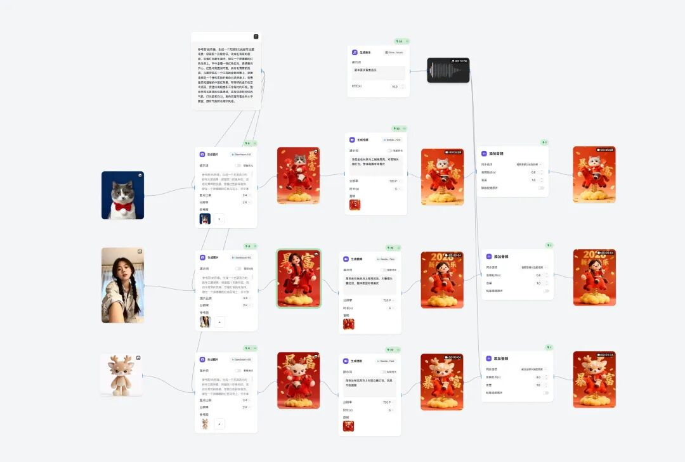
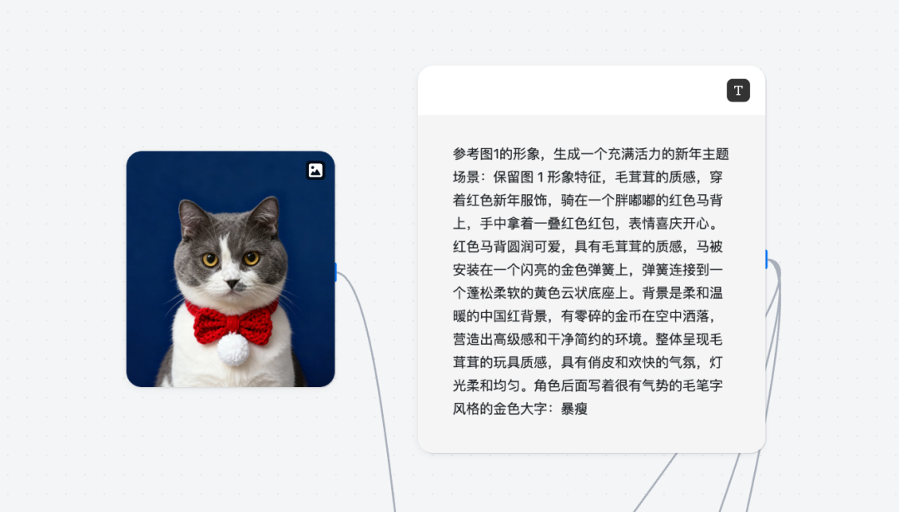
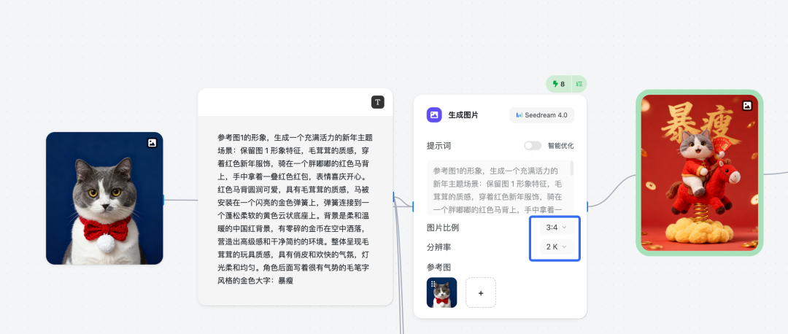
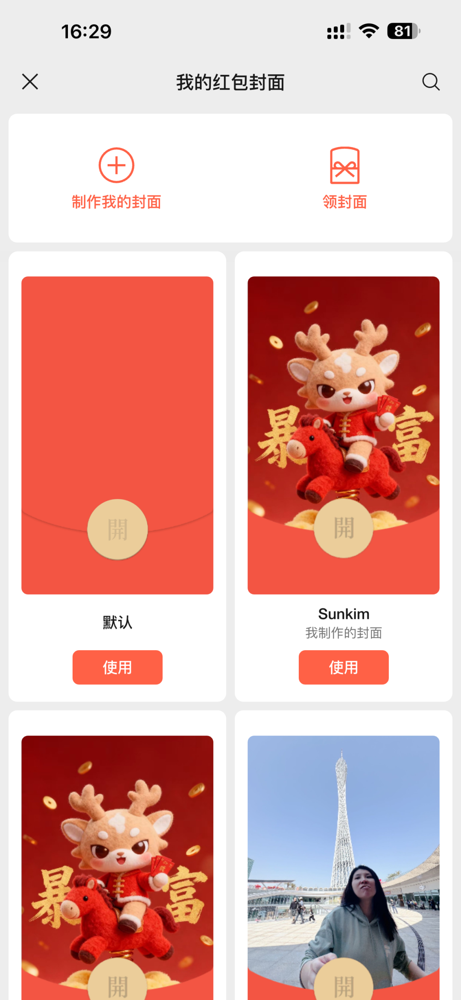
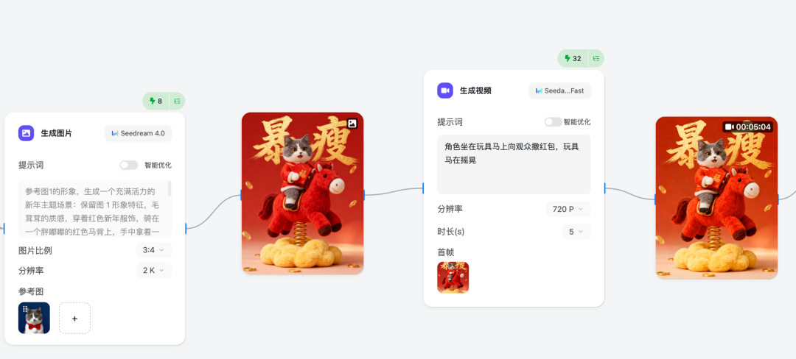
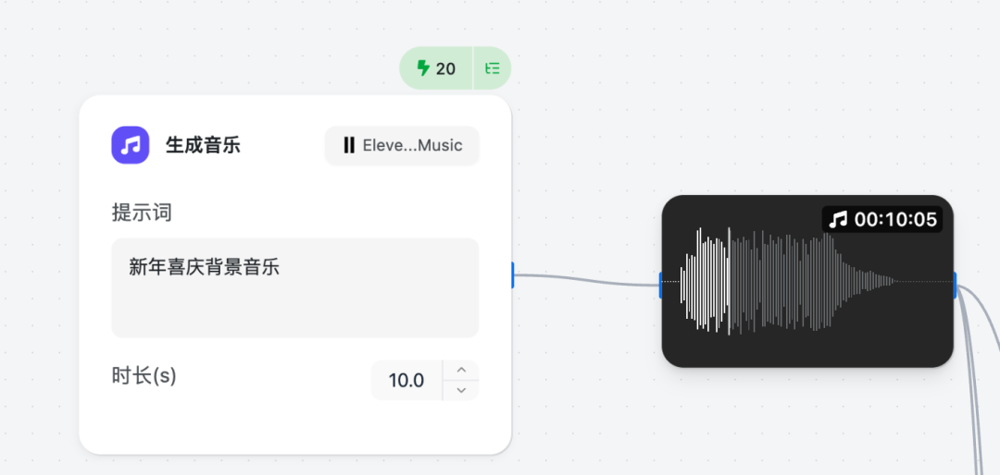
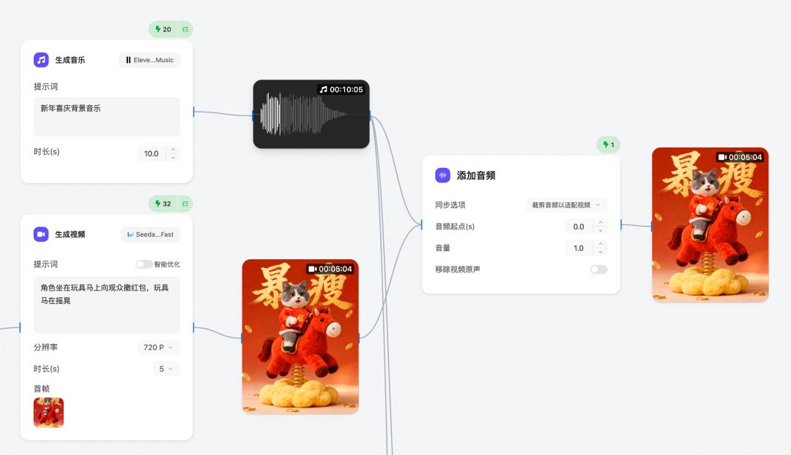

# AI图像与视频创作

## 📓 文章 6

> 文档 ID: `E76gwpqIVitwjCk7UUyc65KOnTe`

**来源**: 拒绝被割！某宝卖 9.9 的红包封面，我用 AI 做了 100 套，成本居然只要 1 块钱？ | **时间**: 2026-01-01 | **原文链接**: https://mp.weixin.qq.com/s/VxKYYYOM...

---

### 📋 核心分析

**战略价值**: 用 AI 生图工具（Mulan）+ 微信红包封面开放平台，7步流程制作个人专属红包封面（含静态图片版 + 动态视频版），完全替代付费购买渠道。

**核心逻辑**:

- **平台分类**：微信红包封面分两种——**个人图片版**（无门槛、审核快、仅限静态图）和**组织动态版**（需注册认证微信红包封面开放平台，支持视频/动态格式，有尺寸格式要求）
- **工具选择**：可用 Mulan、即梦、豆包等任意生图工具，核心是提示词工程，换工具只需适配输入方式
- **Mulan 注册入口**：https://mulan.pro/signup?referral_code=ttnXJGBf（使用此链接自动获得 +200 积分）
- **画布配置**：新建画布后，添加一个**文本框**（填写提示词）+ 一个**图片框**（上传个人形象照），两者连接到"生成图片"节点
- **图片生成参数**：比例 **3:4**，分辨率 **2K**
- **提示词可定制部分**：手持道具（如"一叠红包"→"冰糖葫芦"→"大风车"）、封面大字（如"暴富"→"暴瘦"→"暴顺"）——直接替换提示词中对应内容即可
- **动态版额外步骤**：在图片生成节点后接"生成视频节点"（输入动作提示词）→ 接"音乐节点"（输入"新年喜庆背景音乐"）→ 接"添加音频节点"合并视频与音频，输出完整成品
- **动作提示词与道具联动**：如果前步图片道具改了（如换成冰糖葫芦），视频动作提示词中对应动作也必须同步修改
- **上传至微信流程**：任意聊天框 → 发红包 → 红包封面 → 制作我的封面 → 上传图片 → 点完成，即时生效
- **时间节点警告**：不要等到大年三十才开始制作，审核需要时间

---

### 🛠️ 操作流程

#### 静态图片版（个人无门槛）

**1. 准备阶段**
- 注册 Mulan（或即梦、豆包等）：https://mulan.pro/signup?referral_code=ttnXJGBf
- 准备一张个人/宠物/吉祥物形象照

**2. 画布配置**
- 新建画布 → 添加文本框 + 图片框
- 文本框填写提示词（见下方模板）
- 图片框上传个人形象照
- 将两者连接到"生成图片"节点

**3. 生成图片节点配置**
- 图片比例：**3:4**
- 分辨率：**2K**
- 点击「⚡️」生成







**4. 上传至微信**
- 微信任意聊天框 → 发红包 → 红包封面 → 制作我的封面 → 上传图片 → 完成




---

#### 动态视频版（组织认证后可用）

**5. 生成视频节点**
- 将步骤3的图片结果连接到"生成视频"节点
- 输入动作提示词：`角色坐在玩具马上向观众撒红包，玩具马在摇晃`
- ⚠️ 若前步道具有改动，动作描述需同步修改
- 点击「⚡️」生成



**6. 生成音乐节点**
- 新增"音乐"节点
- 输入提示词：`新年喜庆背景音乐`
- 生成一段背景音乐



**7. 合并音视频**
- 新增"添加音频"节点
- 将视频节点 + 音乐节点的输出都连接进来
- 输出最终成品视频



---

### 📦 提示词模板（可直接复用）

```
参考图1的形象，生成一个充满活力的新年主题场景：
保留图1形象特征，毛茸茸的质感，穿着红色新年服饰，
骑在一个胖嘟嘟的红色马背上，手中拿着【一叠红色红包】，
表情喜庆开心。红色马背圆润可爱，具有毛茸茸的质感，
马被安装在一个闪亮的金色弹簧上，弹簧连接到一个蓬松柔软的黄色云状底座上。
背景是柔和温暖的中国红背景，有零碎的金币在空中洒落，
营造出高级感和干净简约的环境。
整体呈现毛茸茸的玩具质感，具有俏皮和欢快的气氛，灯光柔和均匀。
角色后面写着很有气势的毛笔字风格的金色大字：【暴富】
```

**可替换变量（红色标注部分）**：

| 替换位置 | 示例变体 |
|---------|---------|
| 手持道具 | 一叠红色红包 / 冰糖葫芦 / 大风车 |
| 封面大字 | 暴富 / 暴瘦 / 暴顺 / 自定义 |

---

### 📦 工具/平台对照表

| 环节 | 工具/平台 | 关键参数/配置 | 注意事项 |
|------|---------|------------|---------|
| 生图 | Mulan / 即梦 / 豆包 | 比例3:4，分辨率2K | 均可，核心在提示词 |
| 动态视频 | Mulan 视频节点 | 动作提示词需与道具联动 | 道具改了动作必须同步改 |
| 背景音乐 | Mulan 音乐节点 | 提示词："新年喜庆背景音乐" | — |
| 合并输出 | Mulan 添加音频节点 | 视频+音频两路输入 | — |
| 个人封面上传 | 微信App内置 | 发红包→封面→制作我的封面 | 仅支持静态图，无门槛 |
| 动态封面上传 | 微信红包封面开放平台 | 需注册认证，有格式尺寸要求 | 有一定门槛 |

---

### 📝 避坑指南

- ⚠️ **道具与动作必须联动**：图片里角色手持的道具改了（如换成冰糖葫芦），视频动作提示词里的交互动作也要同步修改，否则动作与画面不匹配
- ⚠️ **动态版有门槛**：个人仅支持图片版封面，想要动态/视频版需前往微信红包封面开放平台注册认证
- ⚠️ **尽早制作**：审核需要时间，不要拖到大年三十再开始

---

### 🏷️ 行业标签
#AI生图 #提示词工程 #微信红包封面 #Mulan #春节 #个人IP定制 #零门槛制作


---
