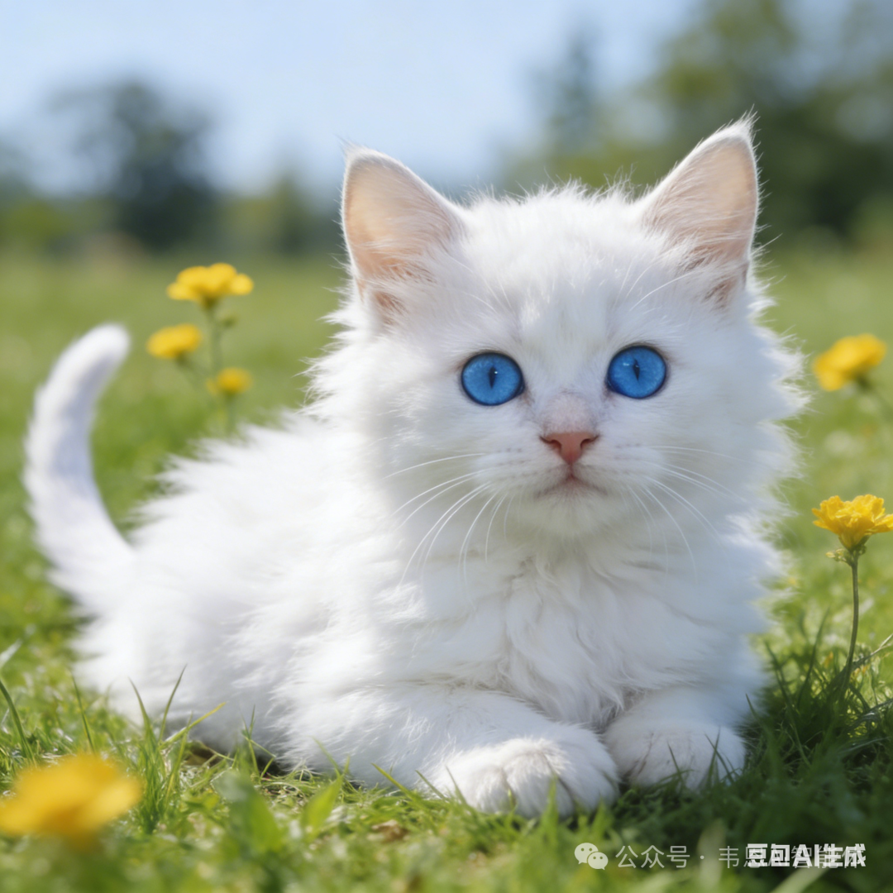
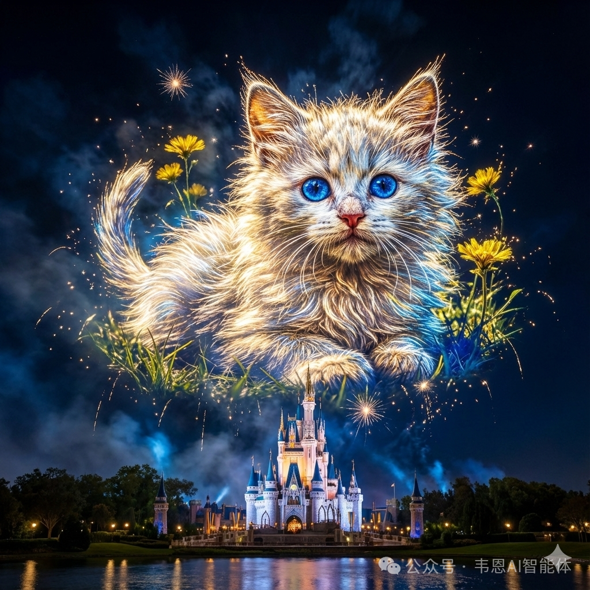
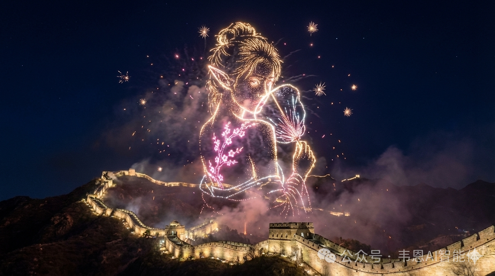
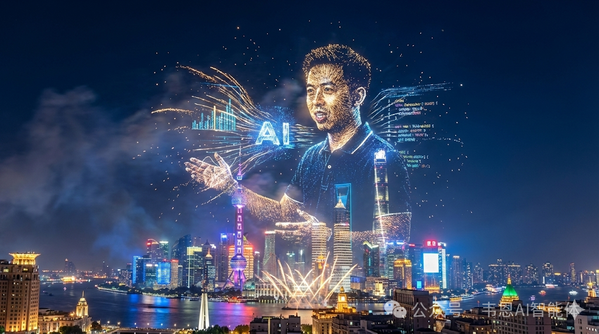

# AI图像与视频创作

## 📓 文章 6

> 文档 ID: `CgezwAZfAioC8tkaDJEc8SvZnKf`

**来源**: 让你的照片变成烟花秀[附提示词] | **时间**: 2026-01-02 | **原文链接**: https://mp.weixin.qq.com/s/9YM9E0v7...

### 📋 核心分析
**战略价值**: 提供一套完整的 Midjourney/AI 图像生成提示词框架，将任意人像/Logo/地图转化为烟花长曝光艺术照。

**核心逻辑**:
- **核心创意机制**：利用"长曝光烟花摄影"视觉错觉——让爆炸的火花轨迹「聚合成形」，形成人脸/文字/标志的轮廓，而非随机散射
- **主体替换是模块化的**：提示词中 `[Insert Your Subject]` 是可替换插槽，支持：发光人像、国家地图轮廓、品牌 Logo、任意剪影
- **画布比例选择逻辑**：`--ar 1:1` 适合社交媒体方图，`--ar 16:9` 适合电影感横幅；主题烟花置顶、地标建筑压底，形成「垂直堆叠+中央英雄」构图
- **底部地标是可替换锚点**：迪士尼城堡、埃菲尔铁塔、城市天际线均可互换，起到「真实感接地」作用
- **夜空留黑是高对比度保障**：深午夜蓝或纯黑背景是烟花形状可读性的前提，不可改为亮色背景
- **光色逻辑**：背景用深黑/深蓝，烟花主体用高强度金色、白色、青色，或品牌主题色（如蓝+黄）；发光体对下方建筑产生边缘光（Rim lighting）
- **质感关键词须成组使用**：`long exposure trails + scattering embers + particle effects + volumetric smoke + glowing plasma + shimmering light dust`，缺少其中几个会导致烟花质感不真实
- **文字入画规则**：若将文字作为烟花主体，字体风格必须是"烟花棒书写体"或"霓虹灯管体"——粗体、发光、草书或块状字形，不可用普通印刷字
- **风格标签组合**：Hyper-realistic Composite Photography + Magical Realism + Light Painting Art + Cinematic VFX，缺少任一标签可能导致风格漂移

---

### 🛠️ 完整提示词（可直接复制使用）

```
A spectacular, surreal long-exposure photography shot featuring a massive 
fireworks display in the night sky. The exploding sparks and light trails 
miraculously cluster together to form a clear, high-definition 
[Insert Your Subject: e.g., glowing portrait of a woman / map of a country / brand logo]. 
The fireworks figure is composed entirely of golden and colored light particles, 
hovering majestically above an iconic illuminated landmark.

Long exposure trails, scattering embers, particle effects, volumetric smoke, 
glowing plasma, water reflection (optional), shimmering light dust.

Deep midnight blue or pitch-black sky. Celebratory, magical, grand scale, 
slightly hazy from the smoke of the fireworks, realistic depth of field.

High contrast palette: deep blacks and blues for background vs. intense Golds, 
Whites, Cyans for the light construct. Emissive lighting — the giant firework 
shape casts soft rim lighting onto the building below.

Style: Hyper-realistic Composite Photography, Magical Realism, Light Painting Art, 
Event Photography, Cinematic Visual Effects (VFX).

--ar 1:1
```

---

### 📦 配置/工具详表

| 模块/功能 | 关键设置/代码 | 预期效果 | 注意事项/坑 |
|----------|-------------|---------|-----------|
| 主体替换插槽 | `[Insert Your Subject]` 替换为目标内容 | 烟花聚合成指定形状 | 越简洁的剪影识别率越高，复杂细节易失真 |
| 画布比例 | `--ar 1:1` / `--ar 16:9` | 方图/电影横幅 | 人像建议 1:1，场景建议 16:9 |
| 背景色 | `Deep midnight blue` / `pitch-black sky` | 最大化光线对比 | 禁止用亮色背景，否则烟花形状消失 |
| 烟花颜色 | Golds, Whites, Cyans，或品牌色 | 主体发光效果 | 颜色种类不超过 3 种，避免视觉混乱 |
| 质感关键词组 | long exposure trails + scattering embers + particle effects + volumetric smoke + glowing plasma + shimmering light dust | 真实长曝光烟花质感 | 必须成组出现，单独使用效果大打折扣 |
| 底部地标 | Disney Castle / Eiffel Tower / City Skyline（可替换） | 增加真实感与空间纵深 | 地标越知名，AI 生成准确率越高 |
| 文字入画 | "sparkler writing" / "neon light tubes"，Bold + glowing + cursive/blocky | 文字融入烟花视觉 | 普通字体风格会导致文字与烟花脱节 |
| 构图逻辑 | Bottom-weighted anchor（建筑压底）+ top-heavy explosion（烟花置顶） | 垂直堆叠层次感 | 若主体居中而非置顶，视觉冲击力下降 |
| 输出语言 | 提示词末尾加：`输出文案优先使用简体中文` | 界面/说明文字为中文 | 仅影响 AI 工具的文案输出，不影响图像生成 |

---

### 🎯 关键洞察

**为什么这套提示词能稳定出图**：

1. **模块化设计** → 降低每次使用的修改成本，只需改一个插槽即可复用全套参数
2. **负空间（Negative Space）策略** → 纯黑夜空是"免费的高对比度画布"，确保任意形状的烟花都清晰可辨，这是长曝光摄影的底层物理逻辑
3. **发光体对建筑的 Rim Lighting** → 这个细节让图像从"合成感"变为"真实感"，因为真实物理中强光源确实会对周围物体产生边缘补光

---

### 📦 变体创作方向










---

### 📝 避坑指南
- ⚠️ 主体形状越复杂（如精细人脸五官），AI 越难精确聚合，建议先用简单剪影测试，再逐步增加细节
- ⚠️ 不指定底部地标时，AI 可能随机生成不协调的建筑，务必明确写出地标名称
- ⚠️ 质感关键词组必须完整保留，单独摘取 1-2 个会导致烟花看起来像 PS 笔刷而非真实物理效果
- ⚠️ 文字作为烟花主体时，英文字母比中文汉字识别率更高，汉字建议配合参考图（垫图）使用

---

### 🏷️ 行业标签
#AI绘图 #Midjourney提示词 #烟花长曝光 #光绘艺术 #AI图像生成 #提示词工程 #创意摄影


---
