# AI学习与效率工具

## 📕 文章 1

> 文档 ID: `IgsRwPRTzicyVHkWOgCcOAqqnDh`

**来源**: 2026年AI学习路线图：AI硬核玩家必看！附100多篇经典论文免费下载 | **时间**: 2026-01-04 | **原文链接**: https://mp.weixin.qq.com/s/aM4Ma8NF...

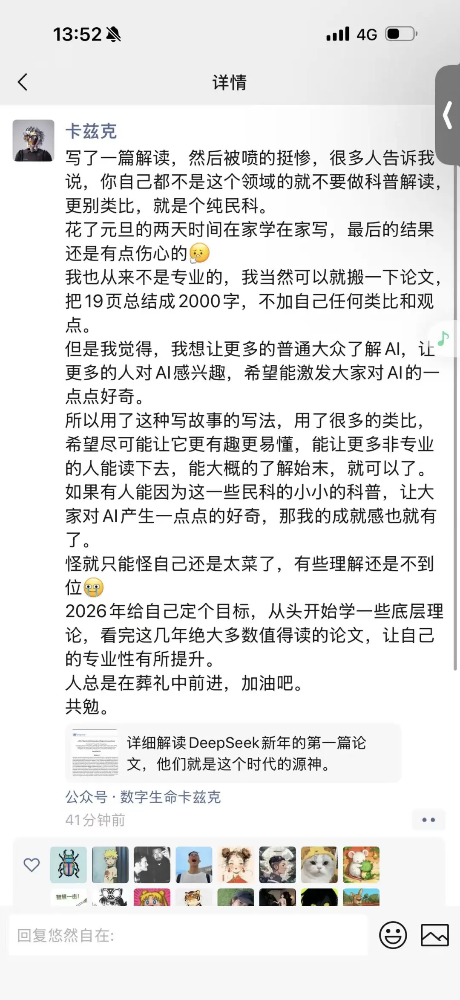
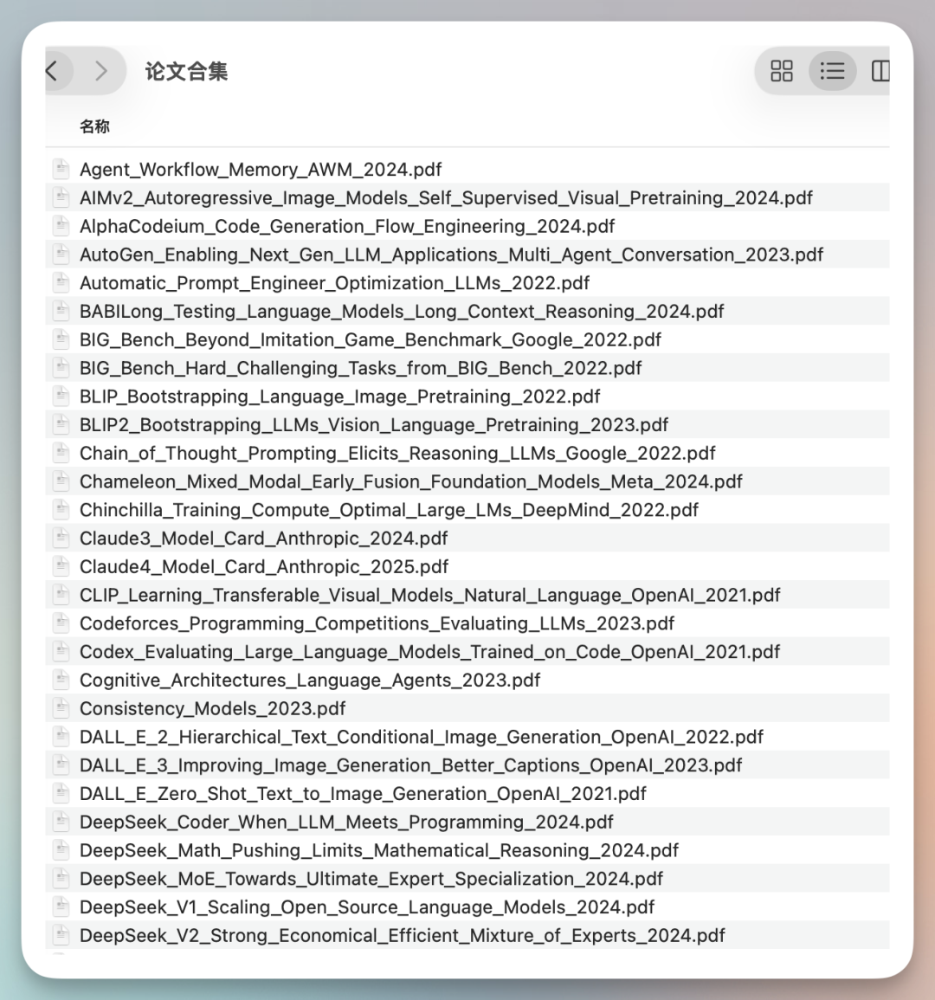
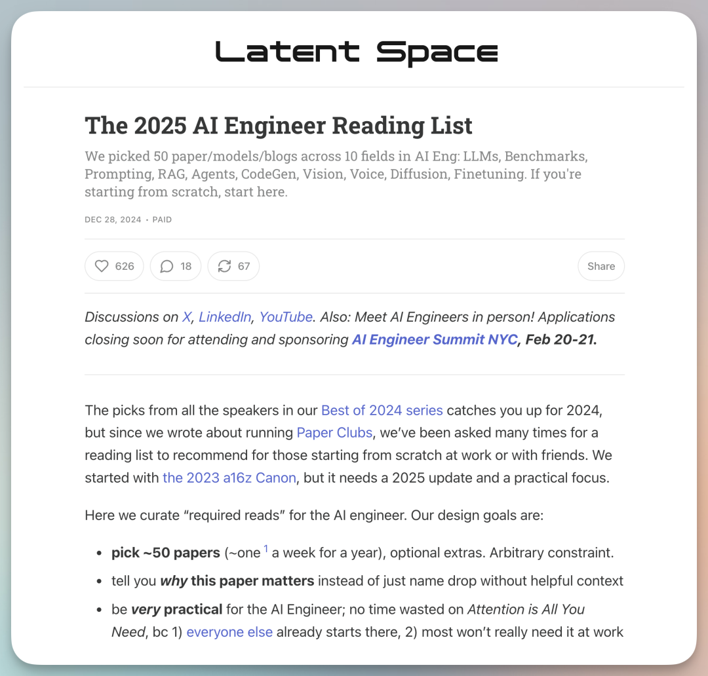
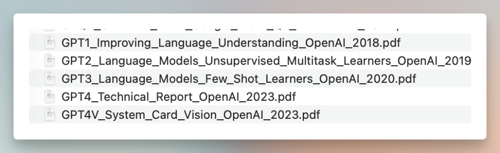
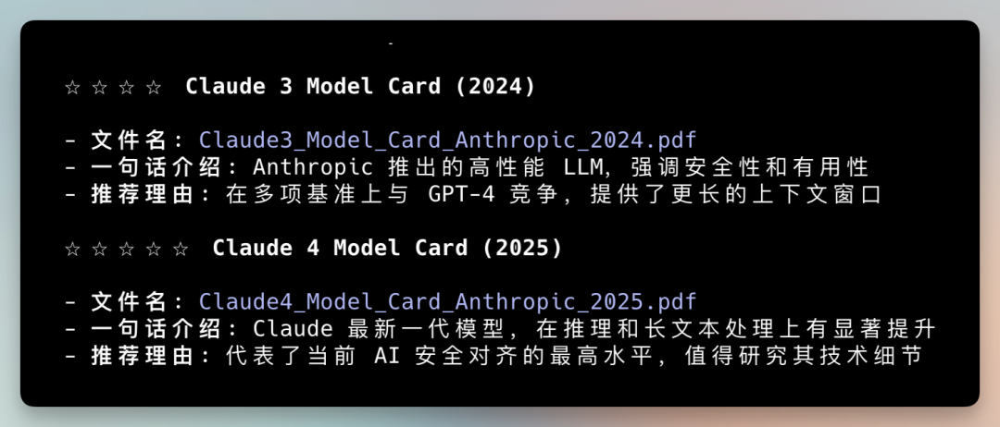
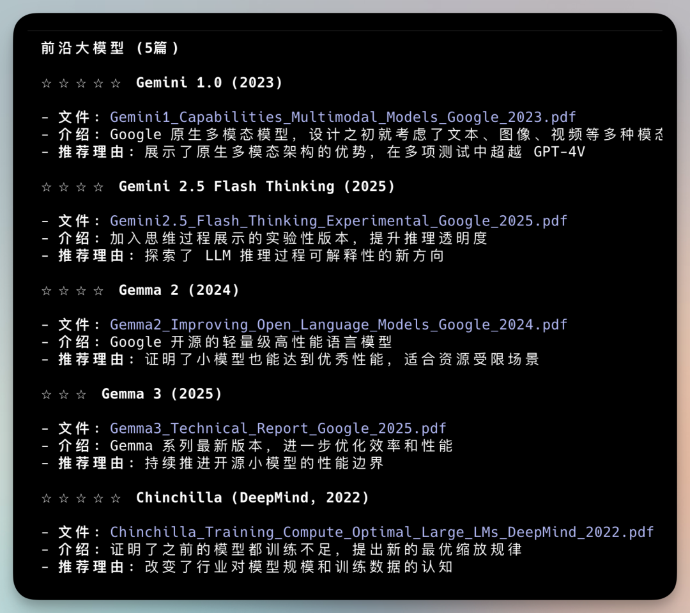
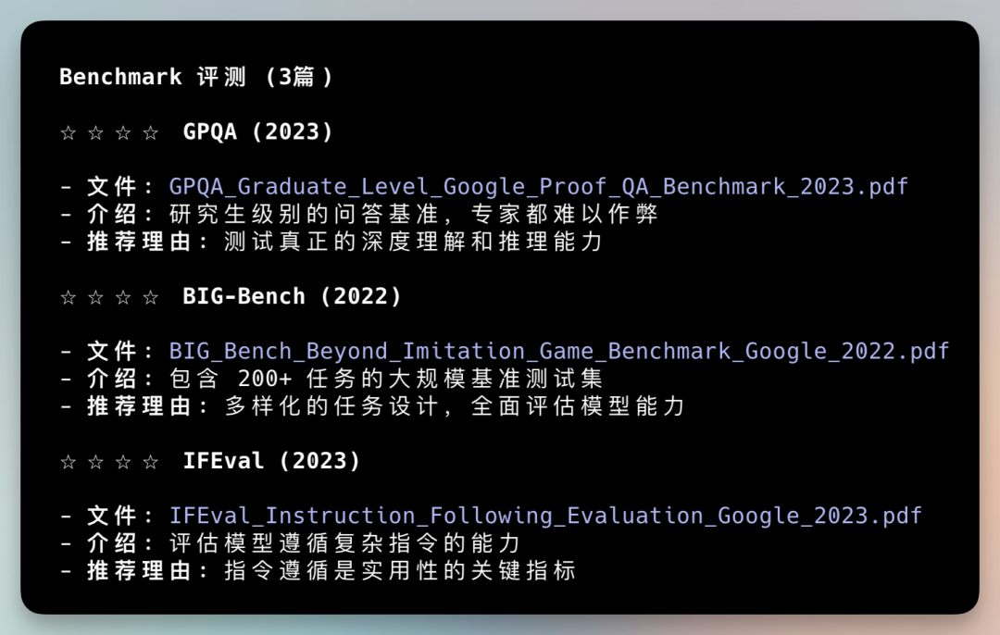
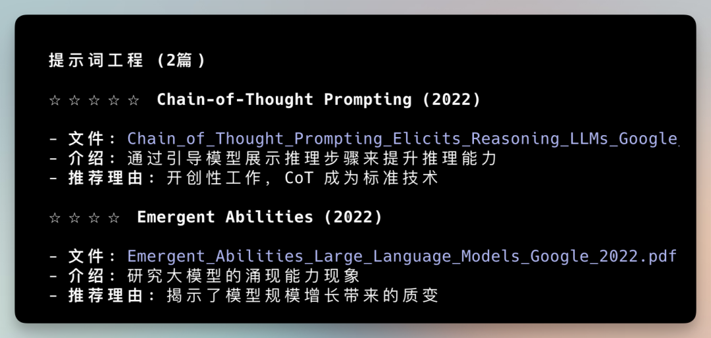
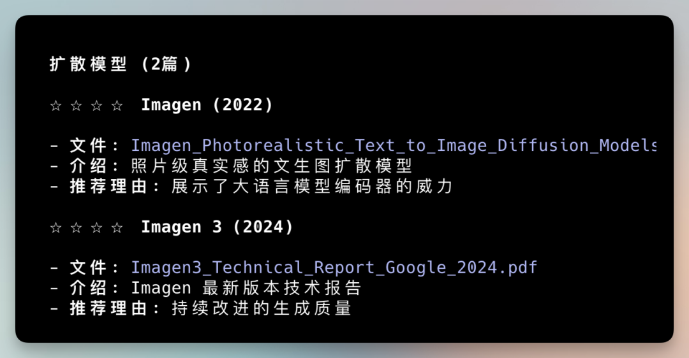
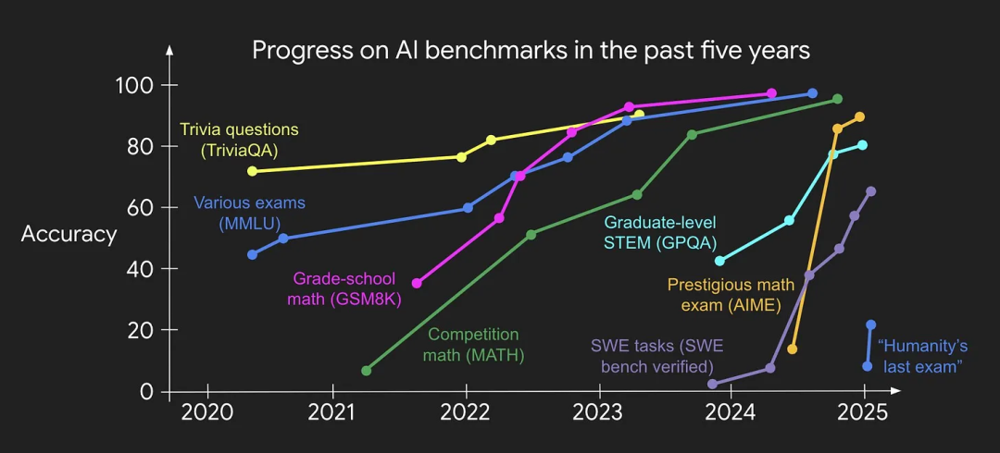
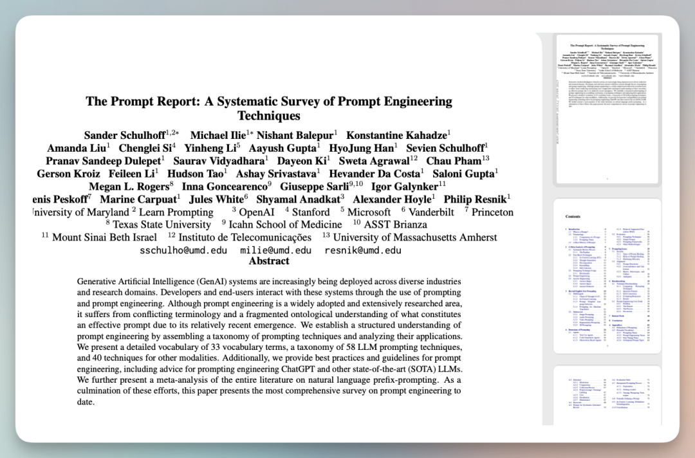
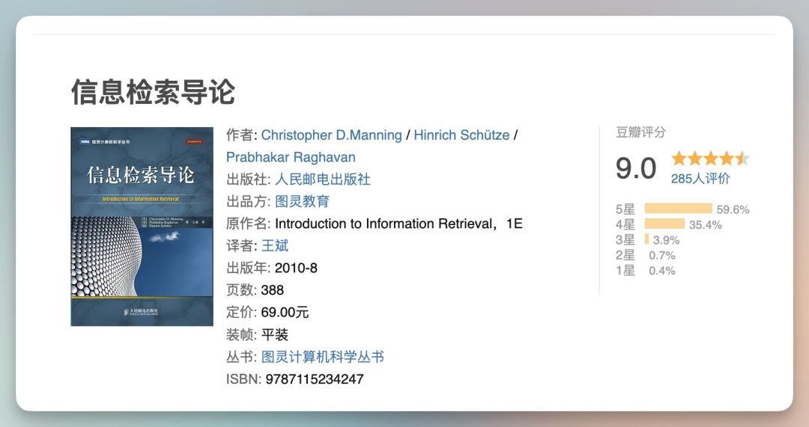
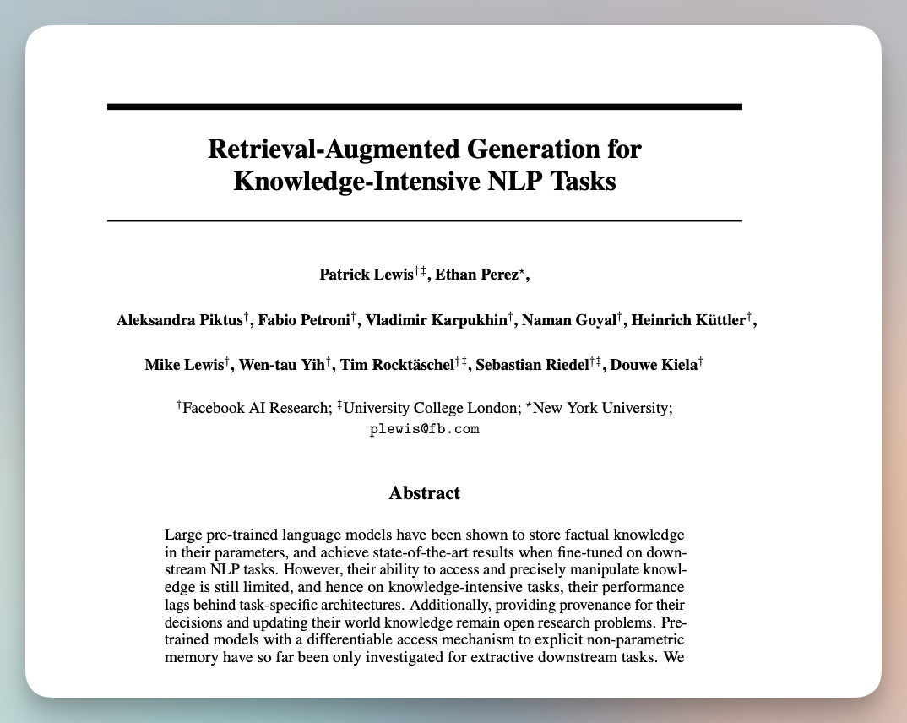
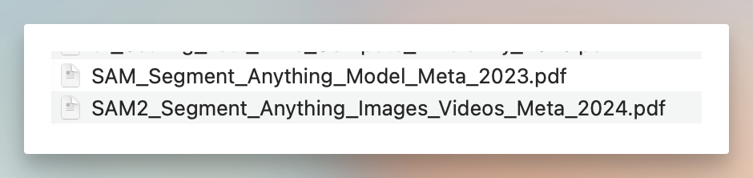

---

### 📋 核心分析

**战略价值**: Latent Space 精选的123篇AI工程必读论文（含下载），覆盖LLM/RAG/Agent/视觉/语音/微调10大领域，附可操作的学习路径与工具资源清单。

**核心逻辑**:
- **论文来源**: Latent Space（AI工程领域最有影响力的播客社区）挑选推荐50篇核心论文，AI补充下载后共计123篇，原文地址：https://www.latent.space/p/2025-papers
- **覆盖范围**: 文本LLM（GPT/Claude/Gemini/Llama/DeepSeek）、评测基准（MMLU/MATH/ARC-AGI）、提示工程、RAG检索增强、AI Agent、代码生成、计算机视觉、语音AI、图像/视频生成、模型微调，共10大技术领域
- **DeepSeek的核心竞争力**: "穷人的智慧"——用创新训练方法（GRPO群体相对策略优化）大幅降低成本；DeepSeek-V3成本只有同等水平模型几分之一；R1推理模型开源，性能接近OpenAI o1
- **推理模型是2025年主流转变**: 传统模型"快思考"（直接回答）→推理模型"慢思考"（内部多步推演验证后给出答案）；代表模型：o1（OpenAI）、R1（DeepSeek开源）、QwQ（阿里，推理过程可见）
- **RAG vs 长文本上下文的核心权衡**: RAG优势是成本低/可解释/易更新；长文本优势是不漏信息/理解全局/架构简单；实践中两者结合——先RAG筛选相关文档，再长文本模型处理
- **基准测试存在刷榜问题**: LeCun已公开承认Llama4刷榜；高分≠好用，应结合竞技场模式（https://lmarena.ai/）和实际场景测试
- **代码生成的工程范式**: AlphaCodeium证明"怎么用"比"用什么"更重要——同样的模型，设计好的执行流程（生成测试用例→多候选解法→验证→错误分析→修复循环）能带来10倍性能提升
- **微调已平民化**: LoRA只调1%参数，QLoRA量化到4位，24GB显卡即可微调70B模型；合成数据（AgentInstruct）让无标注数据也能训练高质量定制模型
- **图像生成架构趋势**: 自回归图像生成（Gemini/GPT/Llama原生图像）正在成为新主流，图像与文字共用同一模型，架构更统一；一致性模型（LCM/sCM）将生成速度提升10倍以上
- **语音AI进入全双工时代**: Moshi（法国Kyutai）实现边听边说、可打断的全双工对话；OpenAI实时API支持低延迟语音输入输出，一个API替代原来ASR+LLM+TTS三服务组合

---

### 🎯 关键洞察

**为什么先读GPT系列论文**：GPT-1→GPT-4展示了AI从"会说话"到"能干活"的完整进化路径。GPT-1确立预训练+微调范式；GPT-3（1750亿参数）实现零样本能力；InstructGPT引入RLHF让模型听人话；这条演化链是理解所有现代LLM的基础。

**为什么ARC-AGI是最重要的基准**：它是目前唯一AI还远远落后于人类的主流基准——最强AI正确率~50%，普通人约70%，人类上限目标85%。它测试的是不依赖记忆的纯粹抽象推理和举一反三能力，是最接近"通用智能核心能力"的测试。一旦AI整体接近普通人水平，视为AGI里程碑。

**思维链为何重要性下降**：2022年"让我们一步步思考"曾是最简单有效的提示技巧，加一句话准确率大幅提升。但2025年后，推理模型（o1/R1/QwQ）已将思考过程内置，外部思维链提示的边际收益显著降低。

---

### 📦 各领域核心论文与工具详表

| 领域 | 核心论文/技术 | 关键数据/特点 | 实用工具/资源 |
|------|-------------|-------------|-------------|
| **LLM基础** | GPT-1/2/3/4, InstructGPT, Codex | GPT-3: 1750亿参数；Codex→GitHub Copilot | — |
| **开源LLM** | Llama 1/2/3, Mistral 7B, Mixtral | Llama3某任务超GPT-4；Mixtral用MoE降低计算成本 | — |
| **中国模型** | DeepSeek-V3/R1, Qwen3, Kimi K-2 | Kimi: 200万字上下文；Qwen3多基准超GPT-4；GRPO训练技术 | — |
| **评测基准** | MMLU(57学科15000题), MATH(12500题), GPQA Diamond, ARC-AGI | GPT-4 MMLU准确率86%；ARC-AGI AI最高~50% vs 人类70%+ | https://lmarena.ai/ |
| **提示工程** | The Prompt Report, Chain-of-Thought, Tree of Thought, DSPy | CoT让推理准确率大幅提升；ToT探索多条推理路径 | https://lilianweng.github.io/ / https://eugeneyan.com/ / https://platform.claude.com/docs/zh-CN/build-with-claude/prompt-engineering/overview |
| **RAG** | Meta RAG论文(2020), GraphRAG(微软), HyDE, RAGAS | RAG 2.0加入多跳推理/动态更新；MTEB: 58个任务 | OpenAI text-embedding-3, Nomic Embed, Jina v3, cde-small-v1 |
| **AI Agent** | ReAct, MemGPT, Voyager, SWE-Bench | SWE-Bench: 2294个GitHub问题；最强系统解决率70-75% | https://lilianweng.github.io/posts/2023-06-23-agent/ / https://rdi.berkeley.edu/adv-llm-agents/sp25 |
| **代码生成** | HumanEval(164题), AlphaCodeium, The Stack(60亿文件/30+语言) | DeepSeek-Coder, Qwen2.5-Coder(92种语言/128K上下文), CodeLlama(7B/13B/34B) | Unsloth notebooks: https://github.com/unslothai/unsloth |
| **计算机视觉** | YOLO v1-v11, CLIP(4亿图文对), SAM/SAM2, DETR | SAM: 零样本分割任何物体；CLIP打通视觉与语言 | GroundingDINO(文字→定位→SAM抠图) |
| **语音AI** | Whisper(68万小时/99语言), NaturalSpeech3, Moshi(全双工) | Whisper v3 Turbo: 实时场景；NaturalSpeech3: 零样本声音克隆 | Elevenlabs, Vapi, Assembly, Deepgram, Cartesia |
| **图像生成** | Stable Diffusion/Flux, DALL-E 3, Imagen 3, 一致性模型LCM | LCM: 1-4步生成(原需几十步)，速度提升10倍+ | Flux Schnell/Dev/Pro, Ideogram, Recraft, ComfyUI |
| **视频生成** | Sora(DiT架构, 最长60秒), Wan 2.x, Kling | Sora基于扩散变换器；2025年正式大规模开放 | Pika, Runway, OpenSora |
| **模型微调** | LoRA, QLoRA, DPO, ReFT, AgentInstruct | LoRA调1%参数；QLoRA 4位量化，24GB显卡微调70B | HuggingFace教程: https://www.philschmid.de/fine-tune-llms-in-2025 |

---

### 🛠️ 操作流程：如何用好这123篇论文

1. **第一周——建立基础认知**:
   - 读GPT系列论文（GPT-1/3/InstructGPT），理解预训练→微调→RLHF的完整链路
   - 读思维链论文（Chain-of-Thought, Let's Think Step By Step），掌握最基础的提示技巧
   - 浏览The Prompt Report，建立提示工程系统性认知

2. **第二周——选定方向深入**:
   - **做应用/RAG方向**: 读Meta RAG原论文(2020)→GraphRAG→RAGAS评估框架；实践时选嵌入模型参考MTEB排行榜
   - **做Agent方向**: 读ReAct→MemGPT→Anthropic《构建有效智能体》(https://www.anthropic.com/engineering/building-effective-agents)；跟进UC Berkeley LLM Agent课程 https://rdi.berkeley.edu/adv-llm-agents/sp25
   - **做代码生成方向**: 读HumanEval→AlphaCodeium→SWE-Bench；实践用Claude Code或Cursor体验AI辅助编程
   - **做视觉方向**: 读CLIP→SAM→MMVP；实践用GroundingDINO+SAM2组合实现"文字抠图"

3. **第三周——微调与工程化**:
   - 用Unsloth notebooks动手微调Llama/Mistral（https://github.com/unslothai/unsloth）
   - 读LoRA/QLoRA论文，理解参数高效微调原理
   - 读DPO论文，理解如何调整模型"性格"（简洁/详细/保守/创意）
   - 评估模型用RAGAS框架，不要只看基准分数

4. **持续跟进**:
   - Twitter + arXiv，AI半年前的"最新"可能已过时
   - 竞技场模式 https://lmarena.ai/ 了解实际用户偏好
   - 关注Lilian Weng博客（https://lilianweng.github.io/）和Eugene Yan博客（https://eugeneyan.com/）

---

### 💡 具体案例/数据

**DeepSeek训练效率**: DeepSeek-V3使用GRPO（群体相对策略优化）——让模型对比多个候选答案的好坏来学习，而非传统PPO的复杂奖励模型。训练成本只有同等水平模型的几分之一。R1推理模型开源，是目前最具参考价值的推理模型训练案例。

**AlphaCodeium流程工程效果**: 在编程竞赛任务上，同样的基础模型，通过设计"理解问题→生成测试→多候选解法→生成推理→验证→失败分析→修改→循环"的完整流程，性能提升接近顶尖选手水平，证明流程设计可带来10倍性能提升。

**SWE-Lancer真实性**: OpenAI的SWE-Lancer测试集包含1400+个来自Upwork的真实自由职业软件工程任务，总金额约100万美元，比SWE-Bench更接近实际工程场景。

**一致性模型速度突破**: 传统扩散模型需要几十步去噪（几秒生成一张图），LCM压缩到1-4步，速度提升10倍以上。2023年12月tldraw"快速绘图"演示病毒传播：用户画一笔，AI实时补全成完整图画。

**Whisper多语言能力**: 在68万小时多语言语音数据上训练，支持99种语言，处理各种口音/背景噪音/语速变化，识别准确率接近甚至超过人类专业语音识别服务。distil-whisper（蒸馏版）适合实时场景。

**QLoRA显存突破**: 模型量化到4位精度，在QLoRA框架下，一张24GB显卡（如RTX 3090/4090）即可微调70B参数的大型模型。

---

### 📝 避坑指南

- ⚠️ **基准分数不等于实际能力**: LeCun已公开承认Llama4存在刷榜，高MMLU分数的模型在你的具体任务上不一定好用。必须结合实际场景测试
- ⚠️ **MTEB"已死"但仍是标准**: MTEB作者自己认为MTEB因过拟合严重已"死"，但目前依然是嵌入模型事实上的评测标准，参考时注意这一局限性
- ⚠️ **YOLO家族史复杂**: 原作者离开后社区出现多个分支，使用时需确认来源和版本
- ⚠️ **思维链技巧重要性下降**: 2025年推理模型（o1/R1）已内置思考过程，传统CoT提示的边际效益大幅降低
- ⚠️ **RAG系统的分块是门学问**: 块太大模型处理不了，块太小丢失上下文，HyDE（先生成假设答案再检索）比直接用问题检索效果更好
- ⚠️ **NaturalSpeech3零样本声音克隆需警惕**: 几秒语音样本即可克隆声音，存在被用于诈骗和伪造的风险
- ⚠️ **Gemini超长上下文幻觉问题**: Gemini 3超过200万token上下文后幻觉严重，实际使用需注意
- ⚠️ **《Attention Is All You Need》未收录**: Latent Space清单更偏向AI工程师实战，部分公认经典论文（如Transformer原始论文）未在123篇内，需另行补充

---

### 🏷️ 行业标签
#大语言模型 #RAG #AI-Agent #提示工程 #模型微调 #计算机视觉 #语音AI #图像生成 #视频生成 #论文清单 #DeepSeek #推理模型 #LoRA #CLIP #SAM

---
