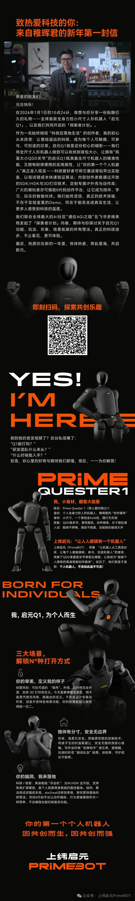

# AI硬件与机器人

## 📕 文章 1

> 文档 ID: `Npsmwx5bUiwpylk8lwvcKF72nHf`

**来源**: 致热爱科技的你：来自稚晖君的新年第一封信 | **时间**: 2026-01-01 | **原文链接**: https://mp.weixin.qq.com/s/3yFeU2sg...

---

### 📋 核心分析

**战略价值**: 稚晖君（彭志辉）以公开信形式宣布启动「个人机器人探索者计划」，面向硬核玩家/开发者开放具身智能机器人共创生态，是国内顶级工程师带头推动AGI×机器人民间研发的标志性事件。

**核心逻辑**:

- **发信人身份确认**：稚晖君（彭志辉），前华为天才少年、智元机器人联合创始人，是国内最具影响力的硬件极客之一，其背书本身即是该计划可信度的核心锚点。
- **发布平台**：上纬启元（PrimeBOT）公众号，2026年1月1日发出，时间节点选择新年第一天，具有强烈的战略宣示意味。
- **计划名称**：「个人机器人探索者计划」，定位是面向个人开发者/玩家的具身智能共创社区，而非面向企业的商业合作。
- **四重福利结构**：信中明确提到「新年四重福利」，说明该计划以资源包/权益包形式对外开放，具体福利项目需关注后续推文展开（原文截断，未完整披露四项内容）。
- **关键词：「通往AGI之路」**：将机器人探索定性为AGI路径之一，表明该计划的技术哲学是：具身智能（Embodied AI）是实现通用人工智能的必要环节，而非可选项。
- **「共创」模式**：非单向输出，强调参与者与稚晖君/团队之间的双向共建，意味着探索者可能参与产品迭代、数据回流、场景验证等环节。
- **目标人群**：「热爱科技的你」——泛指技术爱好者，但结合「探索者」定位，实际门槛偏向有一定动手能力的硬件/AI开发者、机器人玩家。
- **战略时机判断**：2026年元旦发布，正值国内具身智能赛道融资热潮后的落地攻坚期，稚晖君选择此时拉拢个人开发者社区，意在构建草根生态护城河，对抗纯资本驱动的竞争路线。
- **「个人机器人」叙事**：类比PC时代「个人电脑」概念，暗示其愿景是让机器人像智能手机一样成为个人设备，而非工厂/企业专属工具。
- **上纬启元（PrimeBOT）**：该公司/品牌是稚晖君具身智能方向的落地载体，本次探索者计划是其对外开放生态的首次正式动作。

---

### 🎯 关键洞察

**为什么稚晖君要做「探索者计划」而不是闷头搞研发？**

- **原因**：具身智能的核心瓶颈不是算法，而是真实世界场景数据和长尾任务覆盖——这两点靠企业内部团队根本跑不过去，必须依赖大规模分布式「人肉探索者」。
- **动作**：用福利/资源包吸引个人开发者入场，让他们用自己的机器人在真实家庭/工作场景中采集数据、验证任务、反馈问题。
- **结果**：构建一个低成本、高覆盖的具身智能数据飞轮，同时培育忠实的开发者社区，为后续产品商业化铺路。

**「通往AGI之路」的具身智能逻辑**：

- LLM路线（GPT/Claude等）已证明语言维度的智能可以涌现，但缺乏物理世界交互能力。
- 具身智能补足「感知-决策-执行」闭环，是AGI从数字空间落入物理空间的唯一通道。
- 稚晖君选择从个人机器人（家用/轻量级）切入，而非工业机器人，是因为消费场景的任务多样性远高于工业场景，更有利于通用能力涌现。

---

### 📦 配置/工具详表

| 模块 | 关键信息 | 预期效果 | 注意事项 |
|------|---------|---------|---------|
| 参与入口 | 关注「上纬启元PrimeBOT」公众号 | 获取探索者计划报名/资格信息 | 原文内容截断，四重福利具体条款需追踪后续推文 |
| 计划名称 | 个人机器人探索者计划 | 加入稚晖君具身智能共创生态 | 面向个人开发者，非企业合作通道 |
| 技术方向 | 具身智能 × AGI | 推动机器人通用能力研发 | 需有一定硬件/AI基础，纯小白门槛待确认 |
| 发布时间 | 2026年1月1日 | 新年战略启动节点 | 计划处于早期，细节仍在披露中 |

---

### 🛠️ 操作流程

1. **准备阶段**：关注微信公众号「上纬启元PrimeBOT」，确保能第一时间接收后续推文（四重福利详情、报名表单、入群方式等将在后续推文披露）。
2. **核心执行**：持续追踪原文链接 https://mp.weixin.qq.com/s/3yFeU2sg... 及该公众号后续文章，获取探索者计划完整报名条件与福利清单。
3. **验证与优化**：若有意加入，提前梳理自身技术背景（机器人/嵌入式/AI方向），准备参与共创所需的硬件环境或开发能力，以便在报名时匹配对应探索者层级。

---

### 📝 避坑指南

- ⚠️ **原文内容不完整**：当前可提取内容仅为信件开头+活动预告，四重福利具体内容、报名链接、参与门槛均未在原文中完整呈现，需直接访问原文或关注公众号获取完整信息。
- ⚠️ **勿将「探索者计划」等同于产品购买**：共创计划通常要求参与者投入时间、反馈数据，不是纯粹的消费者权益，入场前需评估自身能否持续投入。
- ⚠️ **上纬启元≠智元机器人**：两者均与稚晖君相关但为不同主体，勿混淆联系渠道和产品线。

---

### 🏷️ 行业标签

#具身智能 #个人机器人 #AGI #稚晖君 #上纬启元PrimeBOT #开发者生态 #共创计划 #机器人探索者

---
