# AI编程与开发工具

## 📗 文章 2

> 文档 ID: `LIqLwEU58isAH3kmp8JccCCNnvg`

**来源**: Claude Code 之父 Boris 的 9 条实战技巧：原来高手的配置这么"朴实无华" | **时间**: 2026-01-03 | **原文链接**: https://mp.weixin.qq.com/s/sRVjVqxT...

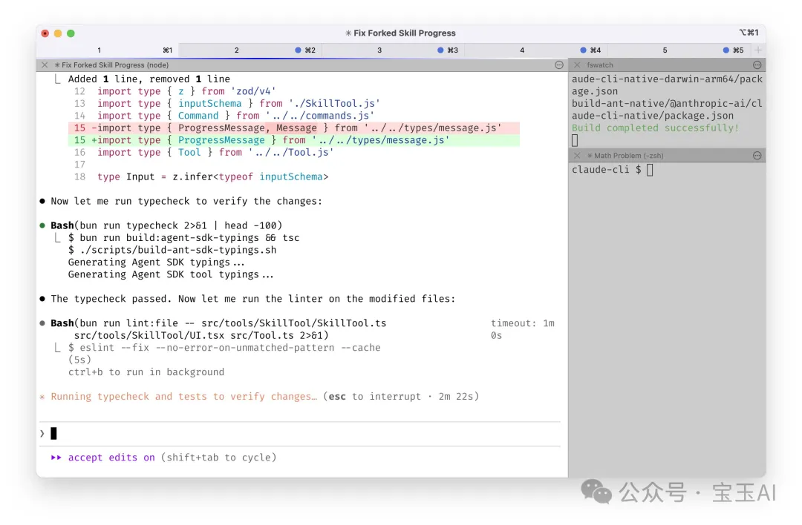
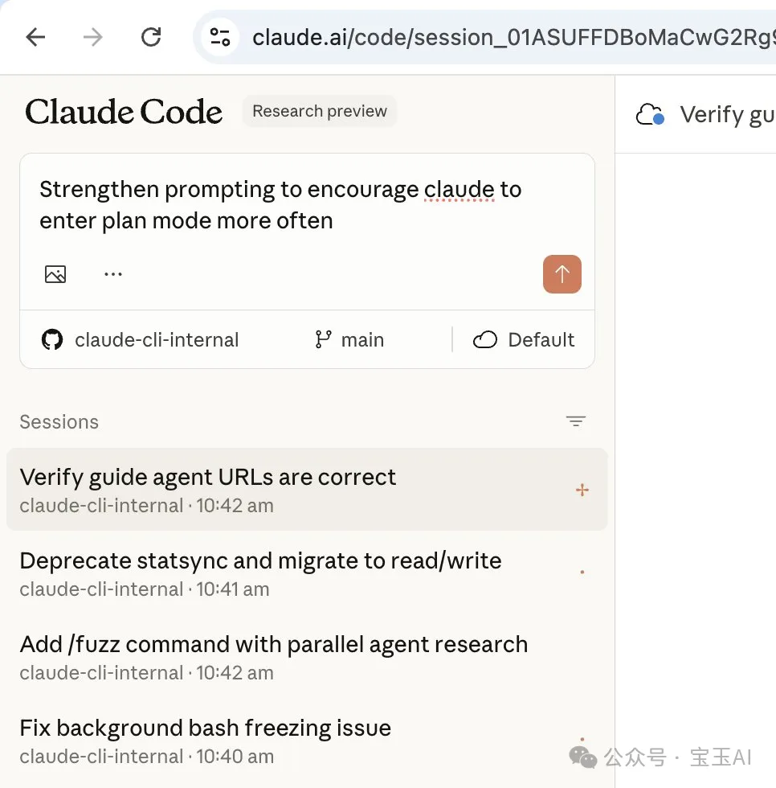
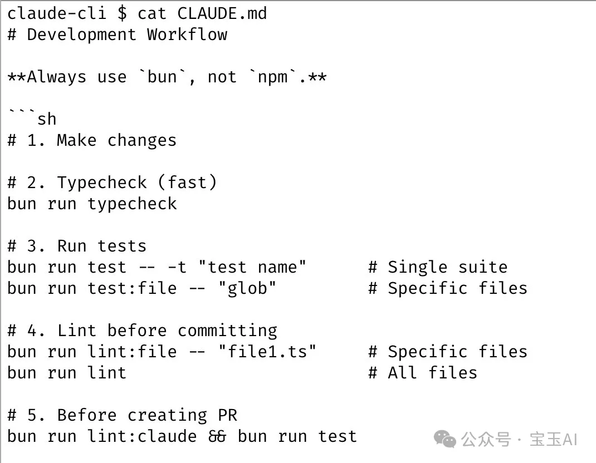
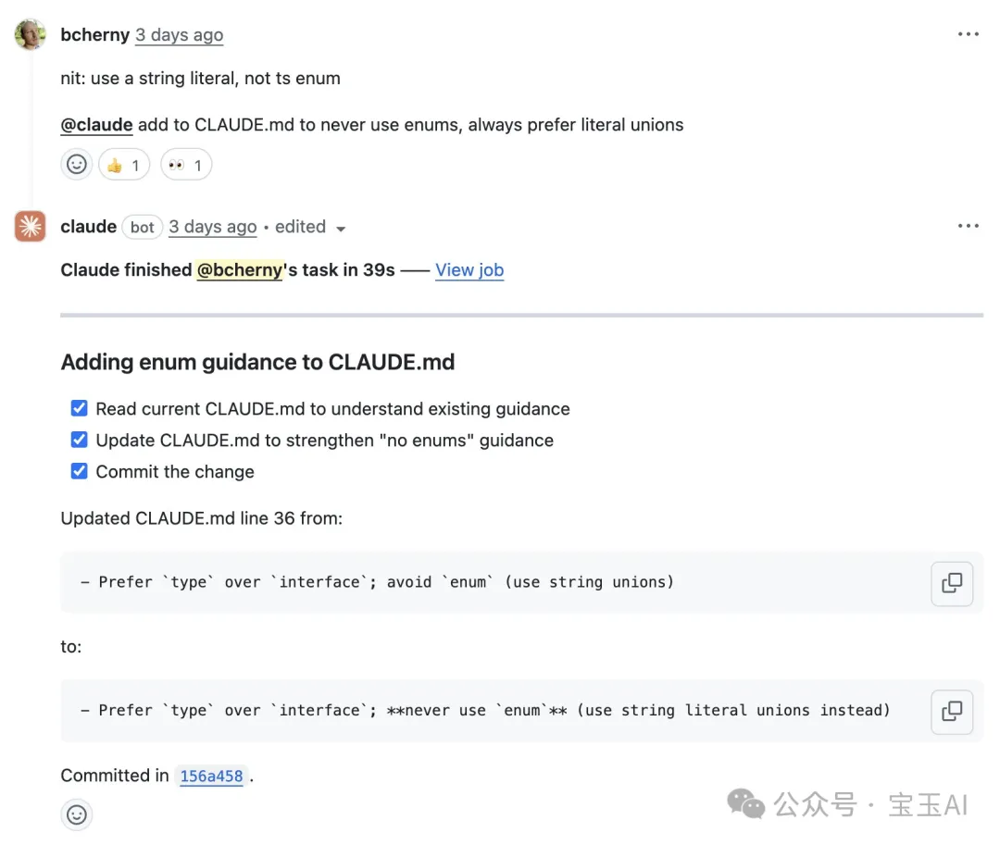
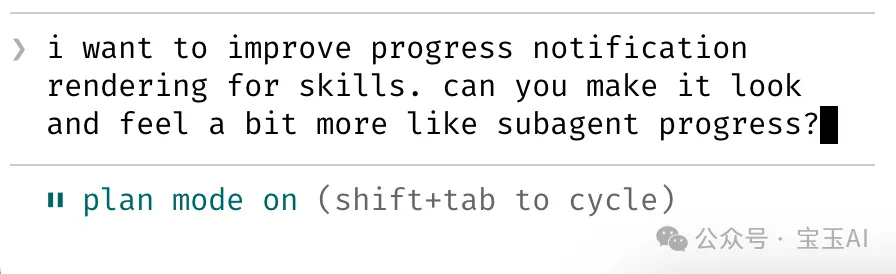
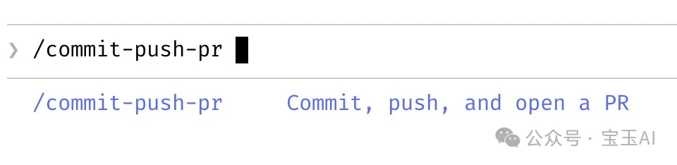
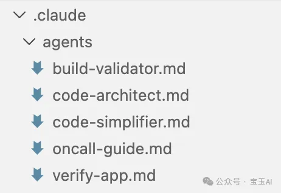
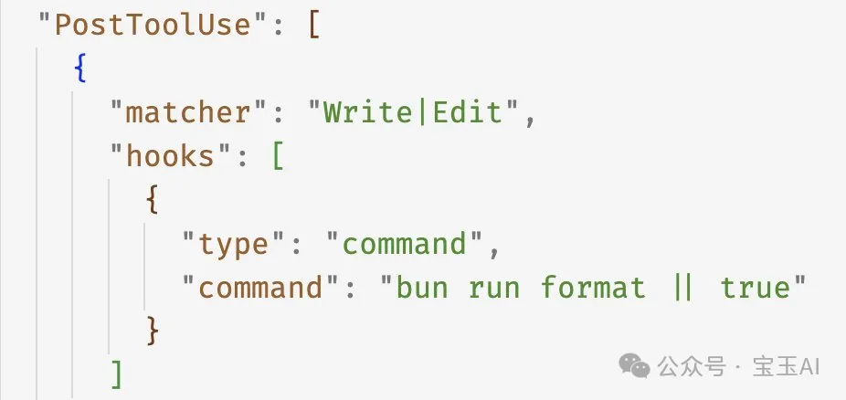
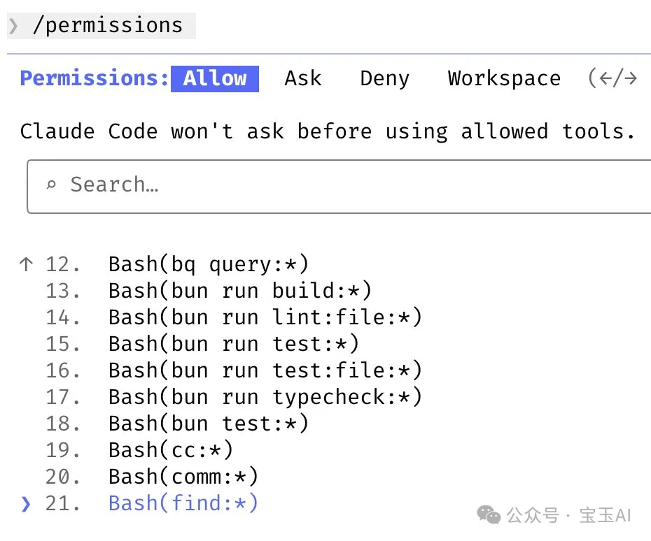
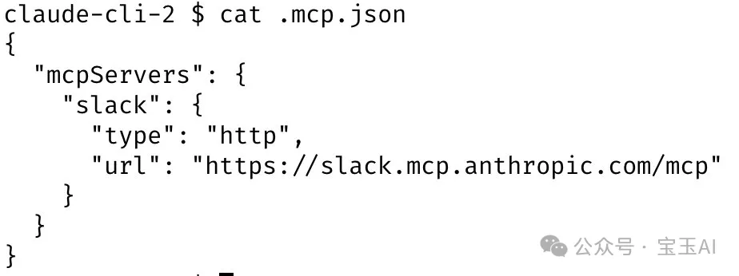
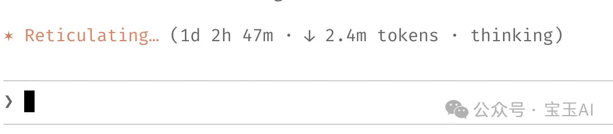
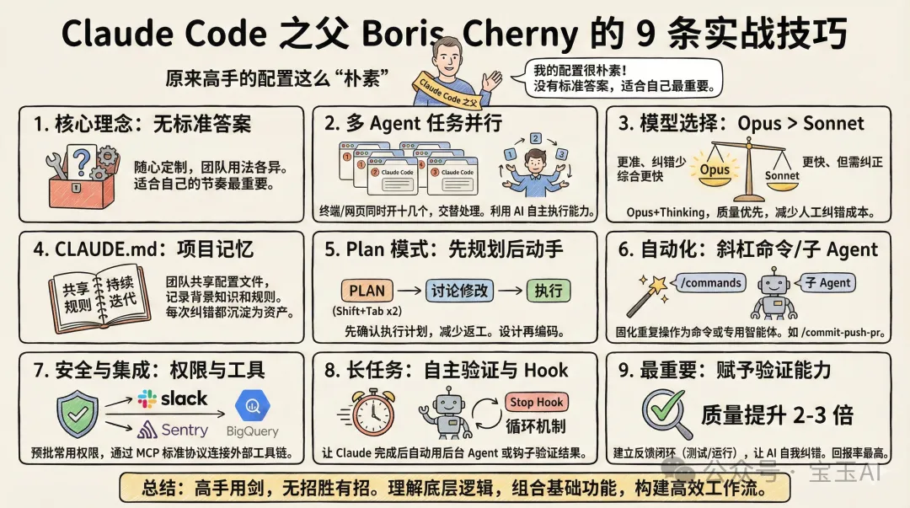

---

### 📋 核心分析

**战略价值**: Claude Code 创始人 Boris Cherny 亲授的 9 条实战工作流——不是花哨配置，而是真正把 AI Agent 用出「质量倍增」效果的底层逻辑与具体操作。

**核心逻辑**:

- **开箱即用优先**：Boris 本人几乎不做定制，Claude Code 出厂配置已足够强大；不要浪费时间找"最佳实践"，适合自己节奏才是关键
- **并行多实例是标配**：终端同时开 5 个 Claude Code 实例（标签页 1-5，开系统通知），网页端 claude.ai/code 再跑 5-10 个任务；两端通过 `&` 符号或 `--teleport` 参数互相切换任务
- **手机启动 + 晚间收割**：每天早上和白天在手机 Claude App 上启动任务，晚些回来查结果——核心是利用 Claude 的自主执行能力，你不需要盯着
- **Opus 比 Sonnet 综合更快**：Opus 4.5 + thinking 模式单次慢，但纠错次数大幅减少、工具调用更准确，总耗时反而更短；时间成本 = 模型响应时间 + 你的注意力和精力成本
- **CLAUDE.md 是团队复利资产**：每次 Claude 做错，立刻把"别这样做"写进 CLAUDE.md 并提交 Git；通过 GitHub Action 里 @.claude 可在 PR 审查时让 Claude 自动追加规则
- **Plan 模式先对齐再执行**：按两下 `Shift+Tab` 切换 Plan 模式，Claude 只给计划不改代码；来回讨论到满意后切自动接受模式，通常一次完成；省掉方向错误的大规模返工
- **斜杠命令固化高频操作**：如 `/commit-push-pr` 一键完成提交+推送+创建 PR；命令本质是 Markdown 文件，放在 `.claude/commands/` 目录，可嵌入 bash 预取数据，提交 Git 全团队共享
- **子 Agent 专业分工**：`code-simplifier` 子 Agent 在主 Claude 完成后自动简化代码；`verify-app` 子 Agent 专门做端到端测试；PostToolUse Hook 自动格式化代码处理最后 10%，避免 CI 格式报错
- **验证闭环是质量倍增器**：让 Claude 能自我验证，最终产出质量提升 2-3 倍；claude.ai/code 的每个改动，Claude 用 Chrome 扩展自测：打开浏览器 → 测试 UI → 发现问题 → 迭代，直到功能正常
- **权限配置用 `/permissions` 而非危险选项**：不用 `--dangerously-skip-permissions`；用 `/permissions` 命令预批准常用安全命令，配置保存在 `.claude/settings.json` 并 Git 共享

---

### 🎯 关键洞察

**为什么 Plan 模式效果好**：传统 AI 使用是"人敲一行、AI 补几行"的串行模式；Plan 模式是把软件工程的"设计先于编码"原则搬到 AI 协作里。直接开干的问题是方向错了返工成本极高，几分钟对齐计划能省几小时返工。

**为什么 CLAUDE.md 是"复利工程"**（Dan Shipper 提出的概念）：每一次纠错行为，传统模式下只对当次有效；写入 CLAUDE.md 后变成团队永久资产，Claude 下次自动遵守。纠错成本从重复支出变成一次性投入，边际成本趋近于零。

**为什么要给 AI 验证能力**：人类工程师靠"写代码 → 测试 → 看结果 → 修改"的反馈闭环保证质量；AI 没有这个闭环就是闭眼做事，质量全靠运气。验证方式不限：bash 命令、测试套件、浏览器测试、手机模拟器均可，关键是必须存在反馈回路。Boris 认为这是回报率最高的投资。

---

### 📦 配置/工具详表

| 模块/功能 | 关键设置/代码 | 预期效果 | 注意事项/坑 |
|----------|-------------|---------|-----------|
| 多实例并行 | 终端 5 个标签页 + claude.ai/code 5-10 任务 | 同时处理 10-15 个任务 | 需要开系统通知，哪个要输入就跳哪个 |
| 终端与网页切换 | `&` 符号转网页；`--teleport` 双向切换 | 任务在终端/网页间无缝交接 | 具体语法参考官方文档 |
| 模型选择 | Opus 4.5 + thinking 模式 | 纠错次数大幅减少，综合速度更快 | 成本高于 Sonnet |
| CLAUDE.md | 放项目根目录，提交 Git；`/init` 自动生成初始版本 | 项目记忆，团队共享，AI 越用越懂项目 | 需要每次看到错误就及时更新，不能一次写完就放着 |
| PR 中更新规则 | 在 PR 里 @.claude，通过 GitHub Action 触发 | Claude 自动把新规则加进 CLAUDE.md | 需配置 Claude Code 的 GitHub Action |
| Plan 模式 | 按两下 `Shift+Tab` 切换 | Claude 只出计划不改代码，对齐后再执行 | 满意后要手动切到自动接受模式 |
| 斜杠命令 | `.claude/commands/` 目录下放 Markdown 文件，可嵌入 bash | 一键执行高频复合操作 | 提交 Git 可全团队共享 |
| 子 Agent | `code-simplifier`、`verify-app` 等专用实例 | 主 Claude 完成后自动触发专项处理 | 文档：https://code.claude.com/docs/en/sub-agents |
| PostToolUse Hook | 格式化 Claude 生成的代码 | 处理最后 10% 格式问题，避免 CI 报错 | Hooks 文档：https://code.claude.com/docs/en/hooks |
| 权限配置 | `/permissions` 预批准常用命令，存入 `.claude/settings.json` | 避免每次弹确认框打断流程 | 不要用 `--dangerously-skip-permissions`（非沙箱环境） |
| MCP 集成 | 接入 Slack MCP、BigQuery MCP、Sentry MCP | Claude 直接发 Slack、跑数据查询、拉错误日志 | MCP 配置提交 Git，全团队开箱即用 |
| 长任务自验证 | 提示词里要求 + Stop Hook 触发后台 Agent 验证 | Claude 完成后自动检验结果，不等人介入 | Stop Hook：Claude 完成响应准备交还控制权时触发 |
| ralph-wiggum 插件 | while true 循环把同一提示词文件反复喂给 Agent | 持续迭代改进直到彻底完成 | 插件地址：https://github.com/anthropics/claude-plugins-official/tree/main/plugins/ralph-wiggum |
| 沙箱长任务 | `--permission-mode=dontAsk` 或 `--dangerously-skip-permissions` | 不被权限确认打断，跑到底 | 仅在沙箱环境使用 |

---

### 🛠️ 操作流程：从零搭建 Boris 式工作流

1. **初始化项目记忆**
   - 在项目根目录运行 `/init`，Claude 自动分析项目结构生成 CLAUDE.md 初始版本
   - 将 CLAUDE.md 提交 Git，全团队维护
   - 规则：每次看到 Claude 做错，立即补一条"禁止 XX"进去

2. **配置高频斜杠命令**
   - 在 `.claude/commands/` 目录创建 Markdown 文件
   - 示例：新建 `commit-push-pr.md`，用自然语言描述操作流程，嵌入 bash 预取 branch 名等信息
   - 提交 Git，团队共享

3. **配置权限白名单**
   - 运行 `/permissions`，预批准常用安全命令
   - 配置自动保存到 `.claude/settings.json`，提交 Git

4. **配置 MCP 外部工具**
   - 接入 Slack MCP、BigQuery MCP、Sentry MCP
   - MCP 配置提交 Git，全团队开箱即用

5. **日常执行：并行多任务**
   - 终端开 5 个标签页跑 Claude Code 实例，开系统通知
   - claude.ai/code 再开 5-10 个任务
   - 早上手机启动任务，白天和晚上回来看结果

6. **单任务启动标准姿势**
   - 先按两下 `Shift+Tab` 进入 Plan 模式
   - 与 Claude 来回讨论计划直到满意
   - 切换到自动接受模式，让它跑到底

7. **配置验证闭环**
   - 在提示词里明确要求 Claude 完成后自我验证（bash / 测试套件 / 浏览器测试）
   - 或配置 Stop Hook，在 Claude 完成时自动触发验证 Agent
   - 参考文档：https://code.claude.com/docs/en/hooks

8. **长任务处理**
   - 选项 A：提示词里要求完成后用后台 Agent 验证
   - 选项 B：使用 ralph-wiggum 插件做持续迭代循环
   - 选项 C：沙箱环境用 `--dangerously-skip-permissions` 跑到底，不被打断

---

### 💡 具体案例/数据

- **验证闭环效果**：Boris 明确给出数据——Claude 能自我验证时，最终产出质量提升 **2-3 倍**
- **claude.ai/code 自测流程**：提交改动 → Claude 打开 Chrome 扩展 → 测试 UI → 发现问题 → 自动迭代 → 直到功能正常且体验合理
- **CLAUDE.md 维护频率**：Claude Code 团队整个仓库共用一个 CLAUDE.md，**每周都有人往里加东西**
- **子 Agent 实际用例**：`code-simplifier`（主 Claude 完成后自动简化代码）、`verify-app`（端到端测试专用）
- **ralph-wiggum 本质**：`while true` bash 循环，把同一个提示词文件反复喂给 AI Agent，直到任务彻底完成

---

### 📝 避坑指南

- ⚠️ **不要在非沙箱环境用 `--dangerously-skip-permissions`**：Boris 本人不用这个选项，用 `/permissions` 白名单代替
- ⚠️ **不要一次性写完 CLAUDE.md 就不管**：它的价值来自持续更新，看到错误必须马上补规则，否则沦为摆设
- ⚠️ **不要只开一个实例串行工作**：Claude Code 擅长自主执行，你不开并行就是浪费它最大的优势
- ⚠️ **不要跳过 Plan 模式直接开干**：方向错了的返工成本远高于几分钟的计划对齐时间
- ⚠️ **不要忽视验证机制**：没有反馈闭环的 AI 输出质量无法保证，这是 Boris 认为「回报率最高」的投资，优先级最高
- ⚠️ **PostToolUse Hook 不能省**：Claude 代码格式通常良好，但最后 10% 如果不处理，会在 CI 阶段集中爆发格式报错

---

### 🏷️ 行业标签

#ClaudeCode #AIAgent #开发者工具 #多Agent并行 #工作流自动化 #CLAUDE.md #MCP协议 #BorisCherry #Anthropic

---
