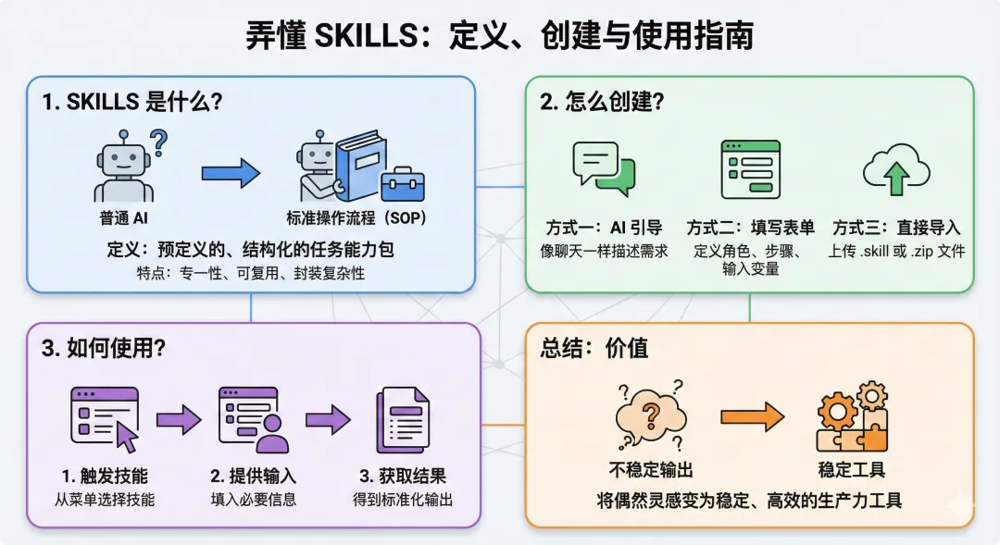
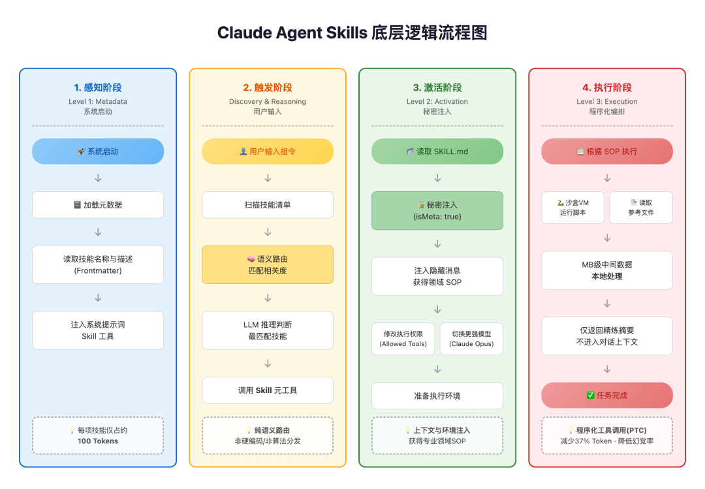

# Agent与技能系统

## 📗 文章 2

> 文档 ID: `D6mJwq1Pmiaa25kT0I8cJs4AnBc`

**来源**: 弄懂SKILLS是什么？怎么创建？如何使用 | **时间**: 2026-01-02 | **原文链接**: https://mp.weixin.qq.com/s/iFM9IyWb...

---

### 📋 核心分析

**战略价值**: Claude Skills 是将通用 LLM 转化为「具备专属 SOP 的数字员工」的核心机制，通过按需加载指令实现 Token 优化与行为确定性的双重提升。

**核心逻辑**:

- **Skills 本质是 SOP 打包机制**：以文件夹形式封装指令（SKILL.md）、脚本（Python）和参考资源，为 Agent 提供标准化执行流程，类比企业 SOP 减少人为误差。
- **两层 Metadata 架构**：Level 1 仅加载技能名称+描述（约 100 Tokens/技能）到系统提示词，仅在匹配时才触发 Level 2 完整指令注入，实现「渐进式披露」，有效防止上下文污染。
- **纯语义路由触发**：Claude 不通过硬编码或算法分发，而是依靠 LLM 自身推理能力对比用户输入与技能 description 的语义匹配度，自主决定激活哪项技能——这意味着 **description 写得好不好直接决定技能能否被正确触发**。
- **隐藏消息注入（isMeta: true）**：技能激活时，系统注入一条对用户不可见的隐藏消息，将该领域 SOP 写入上下文，同时动态修改 Allowed Tools 权限或切换到更强模型（如 Claude Opus）。
- **程序化工具调用（PTC）减少幻觉**：复杂逻辑通过 Claude 编写 Python 脚本并在沙盒 VM 中执行，MB 级中间数据不进入对话上下文，模型只接收精炼结果摘要，可减少约 **37% Token 消耗**并显著降低幻觉率。
- **MCP vs Skills 本质区别**：MCP 负责「数据接入」（将外部数据连接给 Claude）；Skills 负责「逻辑控制」（教会 Claude 如何处理这些数据），两者互补而非替代。
- **三种创建路径对应三种用户场景**：不确定内容用「Create with Claude」对话生成；已知内容用「Write skill instructions」填表单；已有文件用「Upload a skill」导入，覆盖全场景需求。
- **SKILL.md 是技能的唯一核心文件**：无论哪种创建方式，最终产物都是 SKILL.md，结构为 YAML Frontmatter（元数据）+ Markdown 正文（指令），两者缺一不可。
- **技能触发有两种模式**：自动触发（正常聊天，Claude 依据 description 自主判断）和手动调用（网页版输入 `使用 [skill-name] 技能...`，Claude Code 输入 `/[skill-name]`）。
- **文件结构极简，可分发**：.skill 文件本质是改了后缀的 .zip，可直接分享传播，团队共用技能库成本极低。

---

### 🎯 关键洞察

**为什么 description 是整个系统的关键变量？**

整个技能路由层没有任何硬编码规则，Claude 的「选技能」行为完全依赖对 description 的语义理解。这意味着：
- description 写得模糊 → 技能不被触发，或被错误触发
- description 写得精准（包含触发场景、任务类型、关键词）→ 技能在正确时机自动激活

**为什么 PTC（程序化工具调用）是降低幻觉的关键？**

传统 LLM 对话中，所有中间推理结果都堆在上下文里，既消耗 Token 又引入错误累积。PTC 将「计算」交给本地代码执行，LLM 只负责「理解+编排+摘要」，角色分工清晰，幻觉率大幅下降。

---

### 📦 配置/工具详表

| 模块/功能 | 关键设置/代码 | 预期效果 | 注意事项/坑 |
|----------|-------------|---------|-----------|
| 启用 Skills | Settings → Capabilities → 开启 Skills | 技能功能可用 | 必须先开启，否则入口不显示 |
| `name` 字段 | 仅小写字母、数字、连字符，最大 64 字符 | 作为技能唯一标识符 | 不能含空格或大写，否则无法识别 |
| `description` 字段 | 详细描述功能及触发场景，越具体越好 | Claude 语义匹配的核心依据 | 这是最关键字段，决定技能是否被正确触发 |
| `allowed-tools` 字段 | 可选，如 `Read, Write, Bash` | 技能激活时无需额外授权 | 不填则每次工具调用都需用户确认 |
| `model` 字段 | 可选，如 `claude-3-5-sonnet-latest` | 指定运行该技能时使用的模型 | 可按技能复杂度选择不同强度模型 |
| SKILL.md 正文长度 | 建议 500 行以内 | 优化上下文效率 | 超出部分应拆分到独立参考文件中 |
| `{baseDir}` 变量 | 在 Instructions 中引用技能文件夹内的文件 | 动态引用脚本或辅助文档 | 路径相对于技能文件夹根目录 |
| .skill 文件格式 | 本质是 .zip，含根目录 SKILL.md 即可 | 可直接上传导入或分享 | 改后缀前确保 SKILL.md 在根目录，不在子目录 |

---

### 🛠️ 操作流程

#### 文件夹标准结构
```
contrast-storytelling/
├── SKILL.md          ← 必须，核心文件
├── reference.md      ← 可选，复杂参考内容拆分到此
└── scripts/          ← 可选
    └── helper.py
```

#### SKILL.md 标准结构
```markdown
---
name: contrast-storytelling
description: 对比叙事法写作技能，用于公众号/自媒体文章创作，当用户需要写对比类、案例类、启示类文章时触发
allowed-tools:
  - Read
  - Write
  - Bash
model: claude-3-5-sonnet-latest
---

## 项目概述
[简述技能目的]

## 执行步骤（SOP）
1. 分析用户输入的主题和目标读者
2. 构建对比框架（正面案例 vs 反面案例）
3. ...

## 参考资源
详见 {baseDir}/reference.md

## 输出示例
输入：...
输出：...
```

#### 三种创建方式操作步骤

**方式一：Create with Claude（推荐新手）**
1. 进入 Skills 页面，选择「Create with Claude」
2. 用自然语言描述你想要的技能功能
3. 与 Claude 对话完善细节
4. 点击「Copy to your skills」直接添加，或下载文件

**方式二：Write skill instructions（推荐有经验用户）**
1. 选择「Write skill instructions」
2. 填写 Name：如 `contrast-storytelling`
3. 填写 Description：详细描述触发场景
4. 填写 Instructions：即 SKILL.md `---` 之后的 Markdown 正文
5. 保存，系统自动生成完整 SKILL.md 文件

**方式三：Upload a skill（推荐分享/导入场景）**
1. 准备文件夹，根目录放置 SKILL.md
2. 压缩为 .zip
3. 可选：将后缀改为 .skill
4. 在 Skills 页面选择「Upload a skill」，上传文件

#### 技能调用方式
```
# Claude.ai 网页版（自动触发）
直接描述任务，Claude 自动匹配技能

# Claude.ai 网页版（手动触发）
使用 contrast-storytelling 技能帮我写一篇文章

# Claude Code（手动触发）
/contrast-storytelling
```

---

### 💡 四阶段执行流程（底层原理）



| 阶段 | 名称 | 系统动作 | 核心原理 |
|------|------|---------|---------|
| Level 1 | 感知阶段（Metadata） | 所有已安装技能的 name+description 加载到系统提示词 | 每技能约 100 Tokens，低成本感知全部能力 |
| Discovery | 触发阶段 | Claude 扫描技能清单，语义匹配用户指令 | 纯 LLM 推理路由，无硬编码规则 |
| Level 2 | 激活阶段（Activation） | Bash 读取 SKILL.md 正文，注入隐藏消息（isMeta: true） | 上下文+环境注入，同步修改权限或切换模型 |
| Level 3 | 执行阶段（Execution） | Claude 编写 Python 脚本在沙盒 VM 运行，返回精炼摘要 | 程序化工具调用（PTC），减少 37% Token，降低幻觉率 |



---

### 📝 避坑指南

- ⚠️ **description 是最易忽视的关键字段**：description 写得过于简短或模糊（如「写作技能」），Claude 几乎不会触发该技能，应写明具体场景（如「当用户需要写对比类自媒体文章时触发」）。
- ⚠️ **SKILL.md 必须在 zip 根目录**：上传 .zip/.skill 时，SKILL.md 不能放在子文件夹里，必须在压缩包根目录，否则导入失败。
- ⚠️ **name 字段格式严格**：只能用小写字母、数字、连字符，不能有空格或大写，超过 64 字符也会报错。
- ⚠️ **SKILL.md 正文超过 500 行会降低效率**：复杂内容（如大量示例、参考规则）必须拆分到 reference.md，通过 `{baseDir}/reference.md` 引用，而不是全塞进 SKILL.md。
- ⚠️ **Skills 开关必须提前开启**：Settings → Capabilities 里默认不一定开启，未开启时 Skills 入口不可见，新用户容易忽略。
- ⚠️ **MCP 和 Skills 不要混用替代**：MCP 解决数据接入问题，Skills 解决逻辑控制问题，两者定位不同，不能互相替代，复杂场景需要配合使用。

---

### 🏷️ 行业标签
#Claude #AIAgent #Skills #SOP #提示词工程 #LLM工具调用 #程序化编排 #ContextOptimization


---
