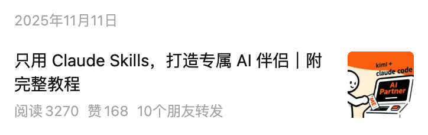
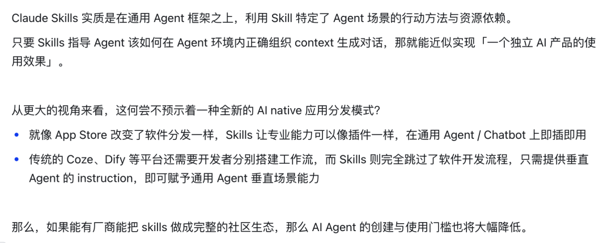

# 内容创作与自媒体

## 📙 文章 4

> 文档 ID: `KtP6wZZv1iyy8qkHSFLcALc8nOf`

**来源**: 一泽：我、AI、2025｜见知录 005 | **时间**: 2026-01-02 | **原文链接**: https://mp.weixin.qq.com/s/Uv9hdoYh...

---

### 📋 核心分析

**战略价值**: 一位 27 岁的前职场人，用一整年时间验证「Build→Learn→Share→Growth」一人公司闭环，同时做出万人用户 AI 产品 Chat Memo 和有圈内影响力的 IP，提炼出可复用的一人业务启动方法论。

**核心逻辑**（10 个要点）：

- **离职后最大的冲击不是收入，是「北极星」消失**：在职场，组织替你承担时代浪潮的冲击；一旦独立，时代变速（DeepSeek R1、Manus 在一个月内爆发）对个体的压力前所未有的真切，焦虑感极其具体，必须主动重建方向感。

- **「做内容」vs「做产品」的抉择困难，根源是环境信息与自我信念双重不足**：与其死磕路径选择，不如先建立个人精力的正向闭环——Build→Learn→Share→Growth，让产品方向牵引技术研究，研究产出内容 Case，内容积累影响力，影响力助推产品冷启动，三条线互相喂养。

- **「Be a builder, not just an influencer」是核心信条**：纯靠观察、测评、仿照，无法真正理解 AI 在具体场景中的边界与趋势。例如：年初亲自实验发现，纯 RAG + Prompt 工程（不需要复杂记忆框架）就足以实现人格化 AI 伴侣；仅一段提示词就能让 AI 精准猜出用户 MBTI——这些判断只有亲手 Build 才能获得。

- **AI 自媒体定位策略：不追新品资讯，追前沿技术理解与行业趋势判断**：作者明确选择不写 Gemini 3 Pro、GPT-4o 生图等节点，判断依据是「只是前代正常演进，无范式变化」；而 Claude Sonnet 4、Gemini 2.0 Flash Imagination 才值得深挖。这种取舍让内容有辨识度，被虎嗅、Founder Park、网易、搜狐等平台转载，同时吸引厂商/企业邀约，形成第一条商业曲线。

- **Chat Memo 的产品洞察：AI 对话记录是这一代人最重要的「原始手稿」**：用户向 AI 倾诉的情绪波动、被推翻的思路、模糊犹豫的回答、无意识的提问风格——这些都是认知迭代、情绪起伏、性格特质的原始数据，是未来「数字自我」的核心资产。问题是这些数据散落在 GPT、Gemini、Claude、豆包、元宝等多个平台，无法统一管理。

- **Chat Memo 的三个核心功能定位**：① 尽可能实时、无感地记录，完全本地存储保障隐私；② 统一、快速检索历史对话数据；③ 100% 数据权限，支持一键导出所有对话记录到本地。整个产品由 AI Coding 开发，零手写代码，已被 Google 认证为精选 AI 记忆扩展，自然增长到 10000 用户量级。

- **Chat Memo 下一步路线图**：跨设备同步数据、支持更多平台接入，以及让 Chat Memo 拥有更多内置 AI 能力——赋予 AI 以长期记忆，帮助用户与 AI 个性化对话，用于自我认知、决策辅助、情绪调节。

- **泛资讯 AI 自媒体赛道的窗口期已关闭**：三个原因——大多数人没有头部博主的信息渠道和更新频率；25 年下半年起受众对新品资讯已产生疲惫感；纯资讯定位无法积累圈内口碑，本质上与打工接单无差异。新账号应从自身业务领域出发，找「个人优势 + 垂类明显没人做好的点」的交集。

- **AI Coding 重构了个人产品的 ROI 逻辑**：很多本来受限于开发成本、划不来做的小产品，现在可以打正 ROI。核心判断：不是用 AI Coding 就必须做 AI 产品；不是所有产品创业都必须 to VC；最大优势来自对自身痛点和兴趣的深度理解。

- **一人公司的成功分级思维**：「小成功」对个人而言就足够——有收入或有影响力的个人副业，不需要追求大公司标准的「大成功」。暂时没取得小成功，往往只是没让外界正确了解到自己的优势，而非能力本身的问题。

---

### 🎯 关键洞察

**个人精力正向闭环的五级模型**（可直接套用）：

```
① 个人优势 + 长期目标 => 短期突破口
        ↓
② 补齐突破时所需的能力差距
        ↓
③ 实践验证、内容分享 => 面向目标群体，打造早期影响力
        ↓
④ 补齐商业资源，实现早期商业化
        ↓
⑤ 早期商业化业务规模化，抽离个人精力发展主线事业
```

**为什么「一鱼多吃」对一人公司特别重要**：个人精力有硬上限，必须让每一份投入同时产出多种价值——研究 AI 技术（能力积累）→ 产出可分享 Case（内容素材）→ 获得评价反馈（IP 增长）→ 转化为可推广产品（商业化）。任何一个节点的产出都在同时喂养其他节点，形成复利。

**AI 趋势判断的实操洞察**（作者亲测，未来 1-3 个月值得重点关注）：「以通用 Agent 为核，Skill 为壳」的低成本垂直 Agent 范式正在兴起，成本低、可组合、可垂直化，作者表示后续会在公众号重点分享 Skill 方向的研究。





---

### 📦 Chat Memo 产品详表

| 模块/功能 | 关键描述 | 预期效果 | 注意事项 |
|----------|---------|---------|---------|
| 数据采集 | 实时、无感记录，完全本地存储 | 覆盖 GPT、Gemini、Claude、豆包、元宝等主流 AI 平台 | 隐私完全本地，不上传云端 |
| 统一检索 | 快速检索全平台历史对话数据 | 跨平台历史对话一键找到 | 当前可能不支持跨设备同步（在规划中） |
| 数据权限 | 支持一键导出所有对话记录到本地 | 100% 数据归用户所有 | — |
| 认证状态 | 已被 Google 认证为精选 AI 记忆扩展 | 官方背书，可信度高 | — |
| 获取方式 | chatmemo.ai 或 Chrome/Edge 扩展商店搜索「Chat Memo」 | — | 在商店留 5 星好评支持作者 |
| 下一步规划 | 跨设备同步、支持更多平台、内置 AI 能力（长期记忆 + 个性化对话） | 从「存储工具」升级为「AI 认知伙伴」 | — |

---

### 🛠️ 新人启动一人业务的操作流程

1. **定位阶段（最关键）**：
   - 不要以「最快最全的资讯」作为竞争力，窗口已关闭
   - 公式：`差异化优势 = 个人优势 + 垂类下其他人明显没做好的点`
   - 从自己想做的业务领域出发，而不是从「什么赛道热」出发

2. **内容执行阶段**：
   - 找能引起别人兴趣的选题
   - 用内容对外传播自己的方法和思考，让目标受众一眼认可你的突出优势
   - 不强求正向反馈，任何外界反馈（正向或负向）都是有效信号

3. **产品开发阶段（针对独立产品方向）**：
   - 用 AI Coding 开发，不强制要求有编程背景
   - 不必做 AI 相关产品，做自己真实有痛点的领域
   - 不必 to VC 融资，小产品 ROI 打正即可
   - 设计简明好看，文案要让人一眼看懂产品优势和用法
   - 做完产品只是第一步，好产品需要主动传播

4. **SEO 基础建设**：
   - 至少要做到：搜索产品名字，能在搜索结果第一位看到自己的产品
   - 即使产品免费、暂未盈利，也在积累口碑影响力

5. **心态校准**：
   - 给自己半年到一年的实验时间，先验不必完美，边走边看
   - 暂时没取得小成功 ≠ 能力不足，可能只是外界还不了解你的优势
   - 赚不到钱也没关系，免费有用的产品同样积累圈内口碑

---

### 💡 作者推荐的年度精选文章（值得再读）

**见知录系列（精品栏目）**：
- 有效的 Context 工程（精读、万字梳理）｜见知录 004
- AI 无法替代的工作们｜见知录 Vol.003
- 见知录 Vol.002：愿你成为独一无二的大模型｜新年特刊

**AI 用法与教程**：
- Chat Memo：构建 AI 时代最重要的个人资产
- 只用 Claude Skills，打造专属 AI 伴侣｜附完整教程
- 堪比模型大突破的万能文生图提示框架，人人都能成为专业 AI 设计师

**思考与测试**：
- 谁是视觉推理 AI 之王？一场游戏，横评 5 大顶流模型（发布一个月后 Altman 在 X 用同款 benchmark 测试了 GPT 模型）
- Google 用文生图 AI 开始真正重塑行业｜9 个测试案例，带你看懂 Gemini 能力边界
- 视频 Agent 的另一层意义？
- 浅谈基于 Phone Use 的 Agent 窘境

---

### 📝 避坑指南

- ⚠️ **不要用「写周报的逻辑」管理自己**：脱离组织后，没有外部 deadline 和 KPI，必须主动构建自己的北极星，否则焦虑感会在 AI 快速迭代的环境中被急剧放大。

- ⚠️ **AI 自媒体做早期账号，不要打资讯速度战**：头部账号有消息渠道优势，追速度是负和博弈，还会被更新频率反向绑架，最终没有精力打磨真正有价值的内容。

- ⚠️ **不要把模型正常迭代升级当成「范式变化」来追**：Gemini 3 Pro 是 Coding 模型的正常提升；GPT-4o 生图是 Gemini 2.0 Flash Imagination 的同项能力进步——追这些对认知提升有限，反而会消耗大量时间和注意力。

- ⚠️ **纯靠 Vibe 和听别人讲述无法准确判断 AI 方向**：想在 AI 浪潮中做出有效判断（包括投资、选品、内容方向），必须亲手 Build，在具体场景中实测边界，否则判断浮于表面。

- ⚠️ **Chat Memo 等 AI 记忆工具的核心价值，不是功能而是数据主权**：AI 对话数据是「数字自我」的核心资产，散落在各平台无法统一管理是真实痛点，工具价值在于把数据权还给用户。

---

### 🏷️ 行业标签
#一人公司 #AI产品 #个人IP #ChatMemo #VibeCoding #AIMemory #独立开发 #内容创业 #Build-Learn-Share #个人精力管理


---
