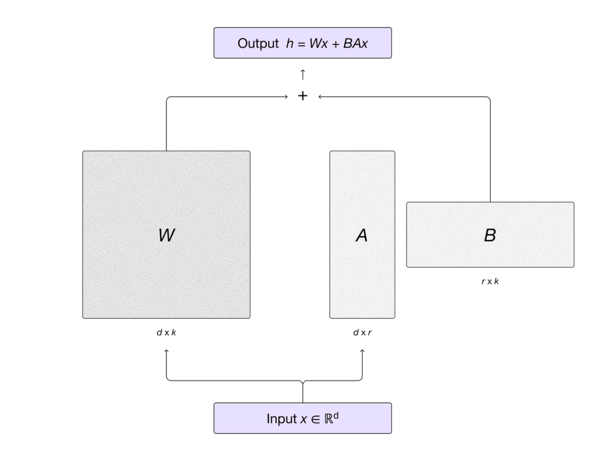

# 大模型技术架构

## 📘 文章 3

> 文档 ID: `EW9gwEqGFiLtmOkXUAZcPP13nCe`

**来源**: 前OpenAI CTO押注的赛道，被中国团队抢先跑通，AI「下半场」入场券人人有份 | **时间**: 2026-01-04 | **原文链接**: https://mp.weixin.qq.com/s/PF4XVyAq...

---

### 📋 核心分析

**战略价值**: Mind Lab 发布的 MinT（Mind Lab Toolkit）是国内首个万亿参数级别的后训练平台，用 CPU 机器即可验证、自动调度 GPU 集群，以全参 RL 约 10% 的算力成本完成 1T LoRA-RL 训练，且完全兼容 Tinker API，直接对标并在技术时间线上领先 Thinking Machines Lab（前 OpenAI CTO Mira 创立，融资 20 亿美元）。

**核心逻辑**:

- **预训练红利耗尽，后训练成 2026 主赛道**：开源社区已有万亿参数级模型，但模型训练完参数即"冻住"，无法适应真实用户需求，强化学习（RL）是让模型从"记住"走向"推理"的唯一破局路径。Gemini、DeepSeek V3.2、Kimi K2 技术报告均明确指出后训练仍是蓝海，RL 未见天花板。
- **Tinker 定义了后训练 API 新范式**：2025 年 10 月 Thinking Machines 发布 Tinker，12 月全面开放，已成为硅谷和美国顶尖高校的训练新范式——类比 OpenAI 定义推理 API，Tinker 定义训练 API。背后资本：2025 年 7 月完成 20 亿美元种子轮，估值 120 亿美元；核心团队含 OpenAI 前研究副总裁 John Schulman、Lilian Weng 等。
- **MinT 在技术时间线上领先 Tinker**：2025 年 12 月 1 日，Mind Lab 比 Thinking Machines 更早实现 1T LoRA-RL，是业界在万亿参数模型上进行高效强化学习的第一个成果，相关方案已开源并获 Nvidia 官方转载。
- **成本压缩 10 倍，GPU 需求降至 64 块 H800**：传统全参 RL 需要大规模 GPU 集群，MinT 采用 LoRA 技术，仅用常规全参 RL 约 10% 的 GPU 资源（64 块 H800）即可在 Kimi K2（万亿参数 MoE）上完成端到端强化学习训练，且一天即可完成一轮训练。
- **CPU 机器即可跑验证，彻底消除算力门槛**：用户只需在本地 CPU 机器上写几行 Python 代码，MinT 自动将计算任务分发至大规模 GPU 集群；集群调度、资源管理、容错恢复全部由平台处理；切换不同模型只需修改代码中的一个字符串。
- **与 Tinker API 完全兼容，零成本迁移**：现有 Tinker 用户可几乎零成本迁移至 MinT；已支持 Kimi K2 Thinking（万亿参数 MoE 推理模型）、Qwen3-VL 系列视觉语言模型，以及 π0 等具身 VLA 模型。
- **迭代周期从"按周"缩短到"按天"**：LoRA-RL 技术让模型迭代速度大幅提升，满足快节奏产品开发需求；并行策略、权重管理、optimizer state 管理、滚动训练、日志与可复现性均按工程标准打通。
- **RL 稳定性突破三大难题**：训练过程中奖励与任务成功率平稳提升，无灾难性发散；held-out 基准上既提升特定任务表现，又保持基座模型通用能力；针对 MoE 路由不均衡与通信压力做了专项优化，相关技术已贡献至 NVIDIA Megatron-Bridge 与火山引擎 verl 等开源项目。
- **团队背景硬核**：创始人 Andrew 毕业于 MIT，现任深圳清华大学研究院研发中心主任，代表作为与姚顺雨合作的 Agent 微调经典工作 FireAct；首席科学家马骁腾博士毕业于清华大学自动化系，深耕强化学习；团队来自清华、MIT、CMU，有 OpenAI、DeepMind、Seed 工作经历，累计发表论文超 100 篇，总引用量超 3 万次。
- **已有多个真实落地案例**：从顶尖高校到垂直行业，MinT 已被实际使用（详见案例部分）。

---

### 🎯 关键洞察

**为什么 LoRA-RL 是后训练的核心路径？**

强化学习面临三大工程瓶颈：
1. **训练不稳**：RL 梯度更新容易出现灾难性发散，特别是在大参数量模型上；
2. **小模型难收敛**：参数量不足时，RL 信号太稀疏，模型无法学到有效策略；
3. **算力成本极高**：全参数 RL 需要对所有参数做梯度计算和更新，显存占用是全参微调的数倍。

LoRA 的解法：只训练少量低秩适配器（adapter），冻结主干参数，显存占用大幅下降，同时允许多个训练和推理任务共享同一计算资源池。Mind Lab 的实验结果表明，LoRA 在选择最优学习率的情况下，训练进程与全参数微调几乎完全一致——这是 1T LoRA-RL 可行的理论基础。

**为什么"CPU 验证 + GPU 执行"的架构具有战略意义？**

当前后训练的最大痛点不是算法不够先进，而是：
- 配置 GPU 环境（驱动、CUDA、通信库）耗费大量时间；
- OOM（显存溢出）导致实验中断，调试成本极高；
- 中小团队在投入大规模 GPU 资源前无法低成本验证算法可行性。

MinT 将"验证"和"执行"解耦：研究者在本地 CPU 机器上完成算法逻辑验证，确认可行后再提交至 GPU 集群。这一设计直接消除了算法研究者进入后训练赛道的最大摩擦。

---

### 📦 配置/工具详表

| 模块/功能 | 关键设置/代码 | 预期效果 | 注意事项/坑 |
|----------|-------------|---------|-----------|
| 本地验证 | 仅需 CPU 机器，写几行 Python 代码 | 无需配置 GPU 驱动，零 OOM 风险 | 验证阶段不执行真实计算，仅验证逻辑 |
| GPU 集群调度 | MinT 自动分发，无需手动配置 | 集群调度、资源管理、容错恢复全自动 | 计算任务由平台托管，用户无需干预 |
| 模型切换 | 修改代码中一个字符串 | 支持 Kimi K2 Thinking（1T MoE）、Qwen3-VL、π0 等 | 全面兼容 Tinker API，现有代码可直接迁移 |
| LoRA-RL 训练 | 低秩适配器训练，共享计算资源池 | 仅需全参 RL 约 10% GPU 资源（64 块 H800） | 需选择最优学习率，否则与全参微调存在差距 |
| 并行策略 | 统一调度张量/流水线/专家/序列并行 | 支持万亿参数 MoE 模型训练 | 针对 MoE 路由不均衡与通信压力有专项优化 |
| 迭代周期 | LoRA-RL 模式 | 从"按周"缩短到"按天" | 适合快节奏产品迭代场景 |
| 开源贡献 | 相关技术贡献至 NVIDIA Megatron-Bridge、火山引擎 verl | 社区可复用，有 Nvidia 官方背书 | 1T LoRA-RL 方案已开源 |

---

### 🛠️ 操作流程

1. **准备阶段**:
   - 访问 Mind Lab 官网 https://macaron.im/mindlab 了解产品定位
   - 查阅文档 https://mint.macaron.im/doc，确认支持的模型列表（当前含 Kimi K2 Thinking、Qwen3-VL 系列、π0 等具身 VLA 模型）
   - 确认使用场景：Agent 领域创业公司 / 高校顶尖实验室 / 具身智能方向
   - 若此前使用 Tinker，无需重写代码，MinT 完全兼容 Tinker API

2. **核心执行**:
   - 在本地 CPU 机器上用 Python 编写训练脚本（MinT 支持纯 CPU 验证模式）
   - 通过修改模型字符串参数切换目标模型（如从 Qwen 切换到 Kimi K2）
   - 提交任务，MinT 自动调度至 GPU 集群执行；集群调度、资源管理、容错恢复由平台全程处理
   - 采用 LoRA-RL 技术路线：只训练低秩适配器，多任务共享计算资源池
   - 关注技术报告以了解 1T LoRA-RL 具体实现方案：https://macaron.im/mindlab/research/building-trillion-parameter-reasoning-rl-with-10-gpus

3. **验证与优化**:
   - 监控奖励曲线与任务成功率：目标为平稳提升，无灾难性发散
   - 在 held-out 基准上同时评估目标任务提升与基座模型通用能力保持情况
   - 利用平台内置日志和可复现性工具追踪实验记录
   - LoRA 学习率调优：选择最优学习率可使训练进程与全参数微调几乎完全一致

---

### 💡 具体案例/数据

**学术机构应用**:
- **清华大学人工智能学院黄高副教授团队**（CVPR best paper 及 NeurIPS best paper runner up 获得者）：利用 MinT 开展"RL 如何突破 Base model 知识边界"研究
- **上海交通大学副教授、上海创智学院全时导师蔡盼盼的 RoPL 实验室**：使用 MinT 在具身决策大模型和决策世界模型方向展开研究

**行业应用**:
- **硅谷创业公司 Eigen AI**：合作探索运用 MinT 和 Data Agent 合成数据在 1T 模型上进行 agentic RL 训练
- **脑机接口公司姬械机**：利用 MinT 支持脑机接口 Agent BCI-Love，实现情感交互对话
- **瑞铭医疗**：利用 MinT 对医疗编码模型进行基于 RL 的后训练，显著提升医疗编码准确率，已落地数十家三甲医院

**核心技术数据**:
- 1T LoRA-RL 实现时间：2025 年 12 月 1 日（早于 Thinking Machines）
- 所需 GPU：64 块 H800（约为全参 RL 的 10%）
- 单轮训练时长：1 天
- 团队论文数：超 100 篇，总引用量超 3 万次

---

### 📝 避坑指南

- ⚠️ **LoRA 学习率必须精心调优**：MinT 基于 LoRA 的理论依据是"选择最优学习率情况下与全参数微调几乎一致"，若学习率选择不当，训练效果会显著低于全参 RL，不可直接套用默认参数。
- ⚠️ **CPU 验证≠GPU 执行等价**：CPU 本地验证阶段仅用于确认算法逻辑和代码正确性，真实训练性能和收敛行为以 GPU 集群执行结果为准。
- ⚠️ **MoE 模型存在路由不均衡问题**：Kimi K2 等 MoE 架构在 RL 训练中会出现路由不均衡与通信压力，MinT 有专项优化，但使用时仍需关注此类指标，避免因路由崩塌导致训练失败。
- ⚠️ **Tinker API 兼容不代表性能等价**：MinT 与 Tinker API 完全兼容，但底层实现不同，迁移后建议重新 benchmark 训练速度和收敛曲线，而非直接复用 Tinker 上的超参配置。

---

### 🏷️ 行业标签

#后训练 #强化学习 #LoRA-RL #MoE大模型 #MinT #MindLab #Tinker #PostTraining基础设施 #Agent训练 #具身智能 #国产AI工具链

---
