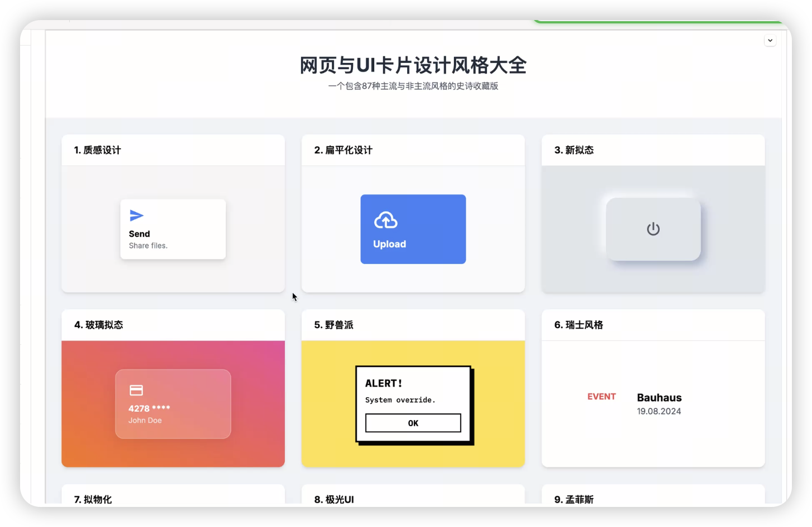

# 提示词工程

## 📘 文章 3

> 文档 ID: `Zm00wXTgqirqfskYobOcJ2r6nBe`

**来源**: 1月3日未来硅世界Vol9：让我们回到提示词和X | **时间**: 2025-01-03 | **原文链接**: 未提供

---

### 📋 核心分析

**战略价值**: 这是一场围绕「提示词底层逻辑 + X平台增长实战 + 生图审美培养」的直播笔记，覆盖从个人表达到AI工具链落地的完整闭环。

**核心逻辑**:

- **提示词本质是「激活能力」而非「下指令」**：好提示词的终极目标是激活AI的底层能力，2026年的核心竞争力定义为「激活元提示词的能力」，而非单纯的使用工具。
- **元提示词的复用策略**：拿到高质量提示词（如神老师的提示词）后，把它喂给AI，让AI反向输出「元提示词框架」，再替换其中变量（风格、语言、审美体系如「日系/苹果美学」），多次迭代后沉淀为自己的专属提示词库。
- **继刚老师 vs 云舒的提示词流派差异**：继刚老师风格适合解决结构化问题（逻辑拆解、框架输出）；云舒的元提示词体系适合做「通用基底」，好不好用取决于应用场景是否匹配。
- **角色模拟类提示词的核心注意点**：必须明确「谁是人类」的边界设定（参考「谁是人类」比赛的经验）；防止AI角色扮演中的身份混淆，不辣的皮皮洛云案例说明角色一致性是核心锚点。
- **数据清洗类提示词建议**：用「一天与AI的废料对话」作为原料，让AI加入数字化第一步的方式是：给AI一个稳定的清洗框架（指定输出格式、分类规则、过滤条件），而非每次重新描述需求，稳定性来自提示词的结构化而非内容的精确性。
- **生图提示词与生文提示词的本质差异**：生图领域的提示词是「视觉语言」，需要包含风格词（Magic Words）、镜头词、光线词等视觉参数；生文是语义逻辑，生图是感官编码，两者底层模型对输入的处理机制不同，不可互换套用。
- **图生图 vs 文生图的适用场景**：文生图适合从零创建概念；图生图适合保留风格一致性、人物一致性或做局部迭代，在「故事性内容」（如AI漫剧）场景下图生图的作用远大于文生图。
- **Magic Words（高级风格词）的来源**：从已有高质量生图作品反向拆解、从Civitai/Midjourney社区的优质案例中提取、通过让AI解释某张图「可能用了哪些关键词」来反推，而非死记硬背词库。
- **故事性表达的提示词维度**：除人物一致性和镜头控制外，还需考虑：情绪弧线（场景情绪的递进）、空间叙事（场景与角色关系的视觉暗示）、时间连续性（上下帧的光线/服装/道具一致性）。
- **X（Twitter）增长的底层逻辑**：核心是「有价值输出 + 利他原则」，时间节点选择至关重要（发帖时间直接影响曝光量级）；账号被封后重整旗鼓的关键是调整表达策略而非内容方向，个人表达能力是不可迁移的核心资产。
- **小红书做号的复利逻辑**：选题共性决定复利上限；基座能力（提示词能力）是做号的底层基础；参考10万粉丝实操干货：https://mp.weixin.qq.com/s/jq-GLDtV5QSrH-Zufe8u6A

---

### 🎯 关键洞察

**元提示词的「变量替换」操作路径**（可直接复刻）：

1. 找到一个你认为效果好的提示词（来源：神老师、云舒、继刚老师等）
2. 把该提示词完整输入AI，加指令：「请基于此提示词，提炼出可复用的元提示词框架，并标注其中可替换的变量」
3. AI输出元提示词框架后，识别变量维度：风格变量（日系/欧美/苹果美学）、场景变量、输出格式变量
4. 替换变量 → 生成新版本 → 评估输出质量 → 迭代修正变量定义
5. 沉淀为自己的「变量词典」，形成可批量调用的提示词资产

**个人表达在X平台的变化规律**（姚金刚视角）：
投入X之前，个人表达是「内容发布」；真正投入之后，个人表达变成「实时反馈系统」——读者的回应倒逼表达精度，逐渐形成「反向追问能力」和「提问题的能力」，这两者是做账号最难培养也最有价值的基座能力。

**Flux（蕉图）使用率低的原因分析**：
不是设计师主动抗拒，而是工作流迁移成本高——现有设计工作流（PS/Figma/AE）与Flux的输出格式和精度要求之间存在工程对接断层；同时生图工具（如youmind）的易用性和稳定性决定了普通设计师的迁移意愿。

---

### 📦 配置/工具详表

| 模块/功能 | 关键设置/代码 | 预期效果 | 注意事项/坑 |
|----------|-------------|---------|-----------|
| 元提示词提炼 | 将目标提示词 + 指令「提炼元提示词框架并标注变量」输入AI | 输出可复用框架 | 需多轮迭代，首次输出往往过于泛化 |
| 生图风格扩展 | 从Civitai/Midjourney优质案例反推Magic Words | 建立个人风格词词典 | 不同模型对同一风格词响应差异大，需在目标模型上验证 |
| 数据清洗提示词 | 指定输出格式 + 分类规则 + 过滤条件，结构固定化 | AI稳定清洗废料对话 | 不要每次重新描述需求，稳定性来自结构而非内容精确 |
| 生图工具 | youmind | 生图流程 | 适合Vibe coding场景 |
| X发帖时间 | 具体时间节点选择（直播中强调时间很重要） | 提升曝光量级 | 不同受众群体的活跃时段不同，需测试 |
| 故事性生图 | 图生图为主（保证上下帧一致性）+ 文生图补充概念 | AI漫剧/连贯叙事内容 | 人物一致性 + 情绪弧线 + 空间叙事三维同时控制 |
| 小红书做号 | 好选题共性 + 利他原则 + 提示词基座能力 | 账号复利增长 | 参考干货：https://mp.weixin.qq.com/s/jq-GLDtV5QSrH-Zufe8u6A |

---

### 🛠️ 操作流程

**流程一：从零构建自己的元提示词体系**

1. **素材收集**：收集市面上质量最高的提示词样本（云舒/继刚老师/神老师体系），不少于5-10个
2. **反向解构**：将每个提示词喂给AI，让AI输出「结构分析 + 变量清单」
3. **变量归类**：整理所有变量，按维度分类（风格维度、场景维度、输出格式维度、角色设定维度）
4. **组合测试**：用不同变量组合生成输出，记录哪些组合效果最佳
5. **迭代固化**：将表现最好的组合模式固定为自己的元提示词模板，建立变量替换词典
6. **场景映射**：为每个常用场景（数据清洗、角色模拟、生图、故事叙事）指定对应的元提示词入口

**流程二：X平台账号从被封到重建**

1. **复盘封号原因**：区分是内容违规（需调整内容策略）还是账号行为违规（需调整操作行为）
2. **保留核心资产**：个人表达风格、内容方向、已积累的素材库，这些不受封号影响
3. **调整表达策略**：重新审视「个人表达」定位，封号后重建是重新校准表达精度的机会
4. **时间节点重新测试**：新账号的发帖时间策略需重新验证，不能沿用旧账号数据
5. **利他原则优先**：每条内容先问「对读者有什么价值」，恶意回复和低价值互动会拉低账号权重

**流程三：生图审美自我升级**

1. **建立参考库**：收集100张以上你认为审美极高的生图，分析共性风格词
2. **Magic Words提取**：将收集图片输入能做图像分析的AI，让其推测「可能使用的风格关键词」
3. **苹果美学体系化**：将苹果美学作为审美锚点，逐步扩展到其他设计语言体系
4. **图生图迭代**：以参考图为基底，通过图生图做风格迁移，而非从文生图重新开始
5. **故事性测试**：用生成的图做连贯叙事测试，验证人物一致性、情绪弧线、空间连贯性

---

### 💡 具体案例/数据

- **案例1 - 角色模拟提示词**：「谁是人类」比赛场景中，角色模拟提示词的核心是「明确人类边界」；「不辣的皮皮洛云」案例说明角色一致性锚定方式决定生成稳定性。
- **案例2 - 小红书10万粉实操**：上周访谈10万粉丝账号，干货已整理：https://mp.weixin.qq.com/s/jq-GLDtV5QSrH-Zufe8u6A 核心要点：好选题共性、做号复利逻辑、基座能力建设。
- **案例3 - 苹果美学作为审美基准**：将苹果美学作为提示词审美起点，逐步向其他风格体系延伸，是嘉宾推荐的审美自我培养路径。
- **数据点 - 直播连线信息**：飞书会议 ID 108 720 872，链接 https://vc.feishu.cn/j/108720872，时间 1月3日 20:00-22:00 GMT+8。

---

### 📝 避坑指南

- ⚠️ **元提示词不是万能的**：元提示词的价值在于「框架复用」，但如果场景特殊性高（如特定数据格式清洗），通用元提示词可能需要大量场景定制才能落地。
- ⚠️ **生图提示词不能照搬生文逻辑**：生图模型对语义的理解方式与生文模型本质不同，直接将生文提示词的结构套用到生图会导致效果混乱。
- ⚠️ **角色模拟中最常见的坑**：没有明确「角色扮演结束的退出机制」，导致AI在角色和助手身份之间混淆，影响后续对话质量。
- ⚠️ **X封号后最忌讳的操作**：用同一设备/IP立刻注册新账号，会触发关联封禁；需要完整的环境重置。
- ⚠️ **图生图的一致性陷阱**：图生图的参考图质量直接决定输出质量上限，用低质量图做参考会固化风格缺陷而非修正。
- ⚠️ **数据清洗提示词的稳定性误区**：试图通过「更精确的内容描述」提升稳定性，实际上应该通过「更严格的输出结构定义」来保证稳定性。

---

### 🏷️ 行业标签
#提示词工程 #元提示词 #X增长 #生图审美 #Flux #图生图 #个人IP #小红书运营 #AI工具链 #故事性叙事

---
