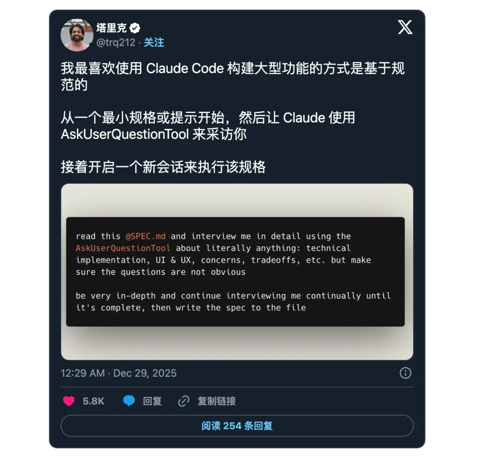
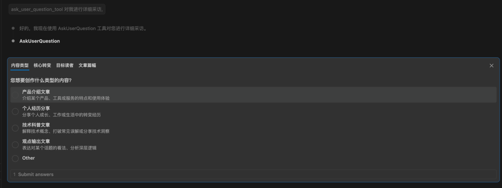

# 提示词工程

## 📔 文章 5

> 文档 ID: `Aan1w51uoifruwk0jeacMSewnLd`

**来源**: Anthropic工程师告诉你怎么和AI聊清楚需求 | **时间**: 2026-01-03 | **原文链接**: https://mp.weixin.qq.com/s/NlSoprdg...




---

### 📋 核心分析

**战略价值**: 通过强制触发 AI 的"深度采访模式"（AskUserQuestionTool），在动手执行前消除所有需求歧义，实现一次性达标、零猜测的精准代码生成。

**核心逻辑**:

- **工具本质**：`AskUserQuestionTool`（或 `ask_user_question_tool`）是 Anthropic 工程生态（Claude Code + MCP）中的核心工具，实现 Human-in-the-Loop 架构，强制 AI 在执行前向用户提问而非自行猜测
- **触发方式极简**：只需在初始需求后附加一句 `ask_user_question_tool 对我进行详细采访`，即可激活采访模式
- **三阶段核心流程**：① 深度访谈 → ② 生成规范文档 → ③ 新会话精准执行，三段分离，各阶段职责明确
- **采访深度量化**：AI 会提出 **15～40 个**结构化问题，涵盖技术栈选择（如 OAuth vs JWT）、UI 偏好、异常处理逻辑等维度
- **置信度门控**：通过提示词要求 AI 持续提问直到 **98% 确定**理解任务，在达到该置信度前**严禁**输出任何代码
- **交互界面结构**：每题含 2～4 个预设选项（Label + Description），支持 `multiSelect: true` 多选，并自动追加 "Other" 自定义输入项，不被预设选项锁死
- **规范文档落地**：访谈结束后将所有决策汇总写入文件（如 `auth_spec.md`），作为后续执行的**唯一事实来源**，新会话直接引用
- **跨模型通用**：虽然在 Claude Code 体验最完整，但通过 MCP 协议或针对性提示词，GPT 系列、Gemini 及其他集成 MCP 的模型均可实现同等交互机制
- **牛津式辩论扩展用法**：告诉 Claude 进行"牛津式辩论"，让其扮演反对派，用该工具主动挖掘你方案中的漏洞和过度设计，适合设计评审场景
- **本质价值**：从"实习生直接写代码"切换到"资深架构师先做咨询"——所有分叉路口在动笔前确认完毕，彻底消除后期调试和 Token 浪费

---

### 🎯 关键洞察

**为什么要先采访再执行？**

原因：AI 默认行为是"基于不完整信息猜测并立即生成"，猜测成本由用户承担（反复调试、大量 Token 消耗、结果偏离预期）。

动作：在指令前置"采访阶段"，强制 AI 将所有决策节点外化为结构化问题，用户在低成本的问答环节做出选择。

结果：进入执行阶段时，AI 已无歧义可猜，代码路径唯一确定，一次性达标率大幅提升。

---

### 📦 配置/工具详表

| 模块/功能 | 关键设置/代码 | 预期效果 | 注意事项/坑 |
|----------|-------------|---------|-----------|
| 基础触发 | 在需求末尾加：`ask_user_question_tool 对我进行详细采访` | AI 暂停执行，进入结构化问答 | 必须在初始需求中明确说明，不能在执行中途触发 |
| 计划详审模式 | `阅读这个计划文件，并使用 AskUserQuestionTool 对我进行详尽的采访，内容涉及：技术实现、UI/UX、风险权衡等，确保问题具有深度且非显而易见` | 覆盖多维度深度问题 | 需提前准备计划文件或内容 |
| 置信度门控 | `请使用澄清问题接口进行询问，直到你 98% 确定自己完全理解了任务并能专家级地实施为止。在达到这一置信度之前，不要展示任何代码` | 强制穷举歧义，零猜测执行 | 98% 门控会显著增加问题数量，需预留时间 |
| 牛津式辩论 | 告知 Claude 进行"牛津式辩论"，由其担任反对派 | 主动暴露方案漏洞和过度设计 | 适合设计评审，不适合日常功能开发 |
| 规范文档生成 | 访谈结束后要求输出 `xxx_spec.md` | 形成唯一执行依据 | 必须开启新会话再引入该文档执行，避免上下文污染 |
| 跨模型适配 | 通过 MCP 协议或针对性提示词 | GPT/Gemini 等模型可复现同等机制 | 非 Claude Code 环境体验不如原生完整 |

---

### 🛠️ 操作流程

1. **准备阶段**：写出你的初步需求（不需要完整，越粗糙越能体现采访价值），准备好相关背景文件（可选）

2. **核心执行——触发采访**：将以下完整提示词复制发送给 AI（将 `[此处输入或拖入你的方案内容或文件路径]` 替换为你的实际内容）：

```
请阅读我的初步需求/方案 [此处输入或拖入你的方案内容或文件路径]，并在开始执行前启动"访谈模式"：

1. 强制调用 AskUserQuestionTool（或澄清问题接口）对我进行深度"采访"，以消除所有歧义。
2. 采访深度要求：问题必须涵盖技术实现细节、UI/UX 偏好、方案权衡（Tradeoffs）、潜在担忧以及非显而易见的边缘情况；请确保提出的问题具有深度，不要问显而易见的问题。
3. 置信度门控：请持续提问，直到你 98% 确定自己已完全理解任务并能以专家级水平实施为止；在达到此置信度前，严禁展示或编写任何代码。
4. 最终输出：访谈结束后，请将我所有的回答与决策汇总，生成一份详尽的技术规范文档（Specification）并写入文件，作为后续实施的唯一事实来源。
```

3. **采访阶段**：逐题回答 AI 提出的 15～40 个结构化问题。每题有 2～4 个预设选项可选，也可选 "Other" 输入自定义答案，支持多选

4. **规范生成**：采访结束后，让 AI 输出完整的技术规范文档（`spec.md`），审阅确认内容无遗漏

5. **验证与执行**：**开启新会话**，将规范文档作为背景上下文输入，指令 AI 按规范执行。禁止在采访会话中直接继续执行，避免上下文干扰

---

### 💡 具体案例

**案例：用户身份验证功能开发**

- 初始指令：`"我想要给我的应用添加用户身份验证功能。请使用 AskUserQuestionTool 对我进行采访，以构建一份规范文档。"`
- AI 行为：暂停自动化流程，弹出结构化问答面板，询问技术栈（OAuth vs JWT）、UI 偏好、异常处理逻辑等问题
- 产出：一份 `auth_spec.md` 规范文档
- 后续：新会话引入 `auth_spec.md`，AI 按图索骥直接生成代码，无需猜测任何决策

---

### 📝 避坑指南

- ⚠️ **不要在执行中途才触发采访**：采访必须在任何代码生成之前完成，否则 AI 已形成先入为主的实现路径，采访价值大打折扣
- ⚠️ **不要在同一会话中采访完直接执行**：采访会话上下文复杂，应开新会话并以规范文档为唯一输入，保持执行上下文干净
- ⚠️ **非 Claude Code 环境需用提示词替代**：GPT/Gemini 等模型没有原生工具支持，必须依赖上述完整提示词模板来模拟采访机制，效果略逊于原生环境
- ⚠️ **98% 置信度门控会显著拉长采访轮次**：时间有限时可降低门控要求，但问题覆盖度要相应降低预期
- ⚠️ **问题不要显而易见**：提示词中需明确要求"问题具有深度且非显而易见"，否则 AI 会问一堆常识性问题浪费时间

---

### 🏷️ 行业标签
#PromptEngineering #VibeCoding #ClaudeCode #MCP #HumanInTheLoop #需求澄清 #AI开发效率


---
